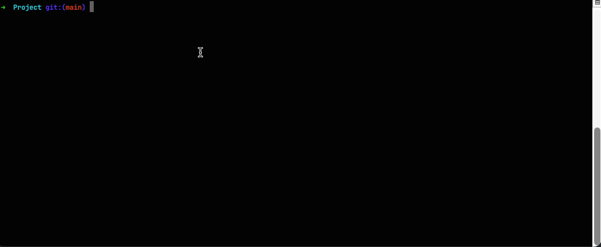
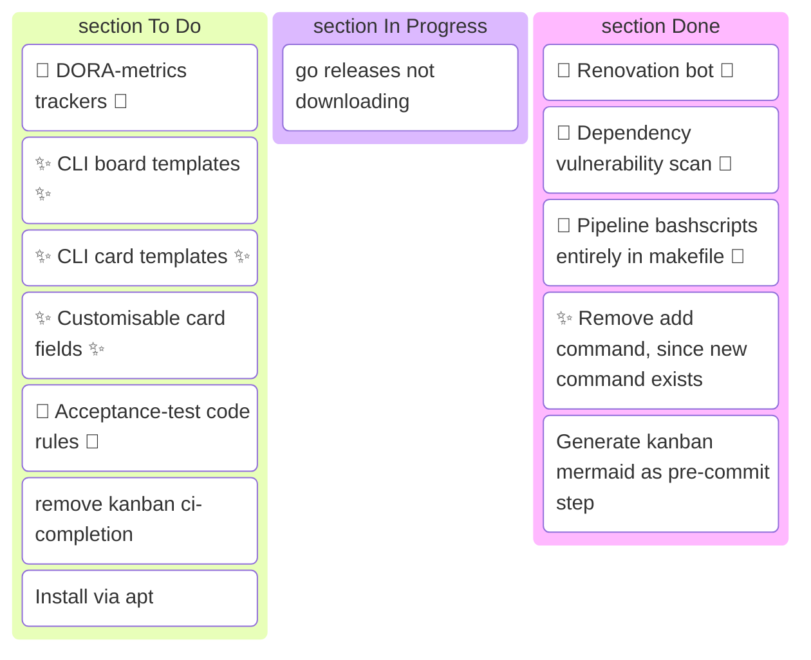

# KANBAN 
kanban is a lightweight CLI app for creating and managing a kanban board. 

```(zsh)
➜  kanban git:(main) ✗ kanban
Kanban task manager for git repositories

Usage:
  kanban [command]

Available Commands:
  board        Display the kanban board
  ci-done      Advance in-progress tasks to done after CI pipeline succeeds
  completion   Generate the autocompletion script for the specified shell
  delete       Remove a task from the board
  done         Mark a task as done (transitions any status -> done)
  edit         Edit a task in $EDITOR
  help         Help about any command
  init         Initialise kanban in the current git repository
  log          Show the git commit history for a task
  new          Create a new task
  start        Start working on a task (transitions todo -> in-progress)

Flags:
  -h, --help   help for kanban

Use "kanban [command] --help" for more information about a command.
```



The board can also be displayed in .md-files:
First manually paste the mermaid representation of your board into an .md file
Obtaining the mermaid representation can be done through the following command:

```(zsh)
➜  kanban git:(main) ✗ kanban board --mermaid
```

Whenever you subsequently want to update the board you can use:

```(zsh)
➜  kanban git:(main) ✗ kanban board --mermaid --out my_file.md
```

This updates the board in place in the file. Updating the mermaid representation of the board can easily be done in a pre-commit hook.

## Planning (Or showcase 😉)




## Installation


```
brew tap jmsargent/kanban
brew install kanban
```

**Install via go install:**

```
go install github.com/jmsargent/Kanban/cmd/kanban@latest
```

Alternatively you can download a binary from the [releases page](https://github.com/jmsargent/Kanban/releases)


## Look ma, no hands!

This project spawned out of being an experiment on getting AI to generate high quality code. There is currently a high influx of poorly designed ai generated 'wibe-code' on the internet. According to [DORA](https://dora.dev/research/) teams that their research group already characterised as "High performing" are able to greatly benefit from gen-AI whereas other teams have not. This project attempts to take available information regarding routines, markers, habbits of high performing teams, and incorporate them and asks the question:

**Is it possible succesfully create a high quality project with minimal manual coding intervention?**

**How does one best leverage AI to get work done, with high quality and delivery speed?**

**Except for **Planning** This readme is human-made.**
