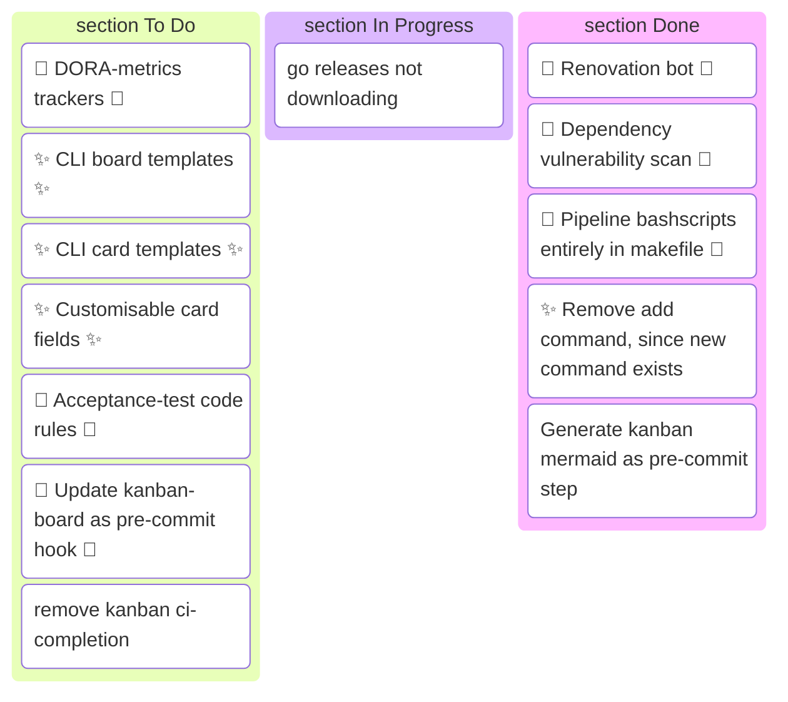

# KANBAN 

This README is humanmade.


## Planning (Or showcase 😉)




## Look ma, no hands!

This project spawned out of being an experiment on getting AI to generate high quality code. There is currently a high influx of poorly designed ai generated 'wibe-code' on the internet. According to [DORA](https://dora.dev/research/) teams that their research group already characterised as "High performing" are able to greatly benefit from gen-AI whereas other teams have not. This project attempts to take available information regarding routines, markers, habbits of high performing teams, and incorporate them and asks the question:

**Is it possible succesfully create a high quality project with minimal manual coding intervention?**

## Installation

**Install via Homebrew:**

```
brew tap jmsargent/kanban
brew install kanban
```

**Install via go install:**

```
go install github.com/jmsargent/Kanban/cmd/kanban@latest
```

Alternatively you can download a binary from the [releases page](https://github.com/jmsargent/Kanban/releases)
