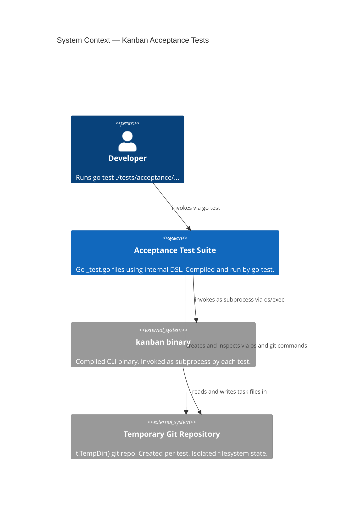
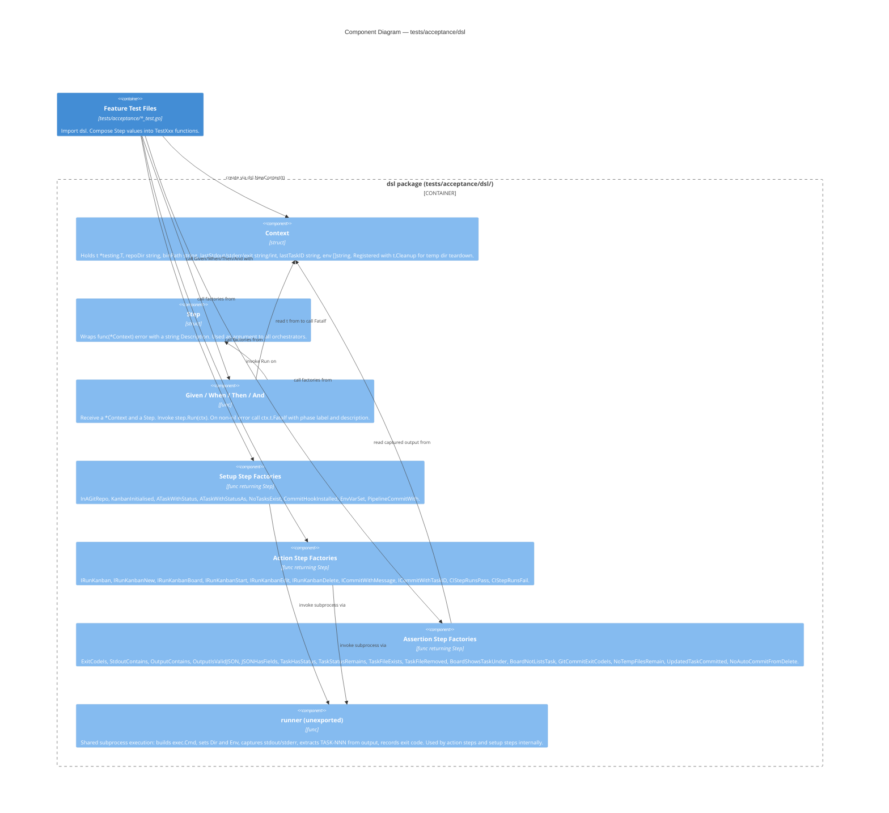

# Architecture Design: Internal Go BDD DSL

**Feature**: acceptance-tests
**Wave**: DESIGN
**Date**: 2026-03-16
**Status**: Proposed

---

## Problem

The existing acceptance test suite uses godog with Gherkin `.feature` files. This introduces an indirection layer: each scenario step is a natural-language string that is matched by regex to a Go function in `kanban_steps_test.go`. The consequences are:

1. **Two artefacts per test**: a `.feature` file and a matching Go step definition file, which must be kept in sync manually.
2. **String-matching fragility**: step registration uses regex patterns. A whitespace or punctuation change in a `.feature` file silently breaks the step binding at runtime, not at compile time.
3. **Refactoring opacity**: Go tooling (rename, extract, find-usages) does not traverse Gherkin strings. Steps cannot be safely refactored with standard tooling.
4. **External BDD dependency**: godog, gherkin, and supporting packages constitute six `indirect` dependencies for a pure-Go CLI project with no natural language consumer.

The BDD readability goal is achievable in idiomatic Go using plain function calls with descriptive names. A Go DSL provides the same `Given / When / Then` structure as Gherkin while being compiled, type-checked, and refactorable.

---

## Solution

An internal DSL package at `tests/acceptance/dsl/` provides:

- A `Context` struct that owns subprocess invocation, temp repo state, environment variables, and captured output.
- A `Step` type (`func(*Context) error` wrapped in a named struct with a human-readable description) used as the argument to each orchestrator.
- Four orchestrator functions — `Given`, `When`, `Then`, `And` — that invoke a step, capture its error, and call `t.Fatalf` with a formatted message on failure.
- Step factories grouped by category (Setup, Action, Assertion) that return `Step` values.

Test files become standard `_test.go` files. Each `TestXxx` function constructs a `dsl.Context`, calls step factories, and passes them to orchestrators. No `.feature` files, no regex registration, no external BDD framework.

---

## C4 System Context Diagram



---

## C4 Component Diagram — dsl Package



---

## Migration Strategy

Migration is incremental. The existing godog suite continues to run unchanged during the transition period.

### Phase 1 — DSL package created, zero test files ported
- Create `tests/acceptance/dsl/` with `Context`, `Step`, orchestrators, and all step factories derived from existing `kanbanCtx` helpers.
- No `_test.go` files are created yet. godog suite is unaffected.
- `go build ./tests/acceptance/dsl/` must pass cleanly.

### Phase 2 — Port feature files one at a time
- For each `.feature` file, create a corresponding `tests/acceptance/<feature>_test.go`.
- Verify the new Go test passes independently (`go test -run TestXxx`).
- Tag the corresponding Gherkin scenario with `@ported` (or move to a `@skip` block) to prevent double-counting.

### Phase 3 — Remove godog once all scenarios are ported
- Delete all `.feature` files.
- Delete `tests/acceptance/kanban-tasks/steps/` (godog suite and step definitions).
- Remove godog and its transitives from `go.mod` / `go.sum`.
- Remove godog path references from `cicd/config.yml`.

### Coexistence rule
During Phase 1 and Phase 2, both test suites run in CI. The godog suite lives at `tests/acceptance/kanban-tasks/steps/` and continues to be invoked as before. The new DSL-based tests live at `tests/acceptance/` and are invoked with `go test ./tests/acceptance/...`. There is no import or code dependency between the two suites.

---

## Architecture Enforcement

Style: the DSL package itself follows no architectural style — it is a test-only utility package.

The critical enforcement rule for this feature is the import boundary:

- `tests/acceptance/dsl/` must not import any package under `internal/`.
- Feature test files (`*_test.go`) must not import any package under `internal/`.

Enforcement tool: `go-arch-lint` (already in use on this project, per CLAUDE.md).

Rule to add to `.go-arch-lint.yml`:

```
acceptance-dsl:
  package: tests/acceptance/dsl
  forbidden_imports:
    - github.com/jmsargent/kanban/internal/**
```

This guarantees acceptance tests exercise the system exclusively through the compiled binary (the CLI driving port), never by calling internal use cases or domain types directly.
