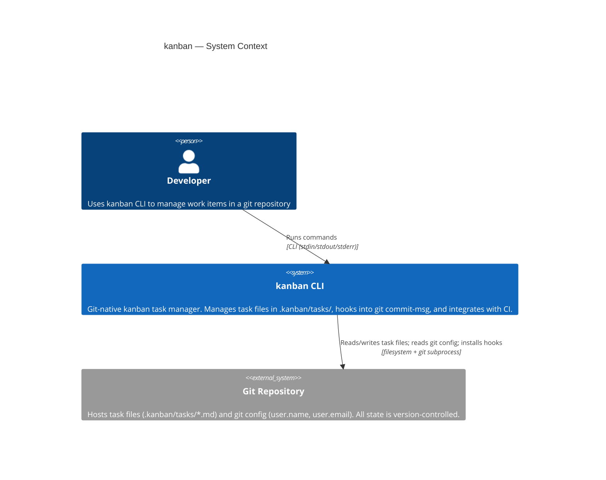
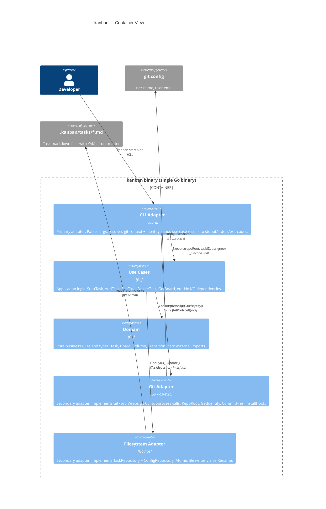
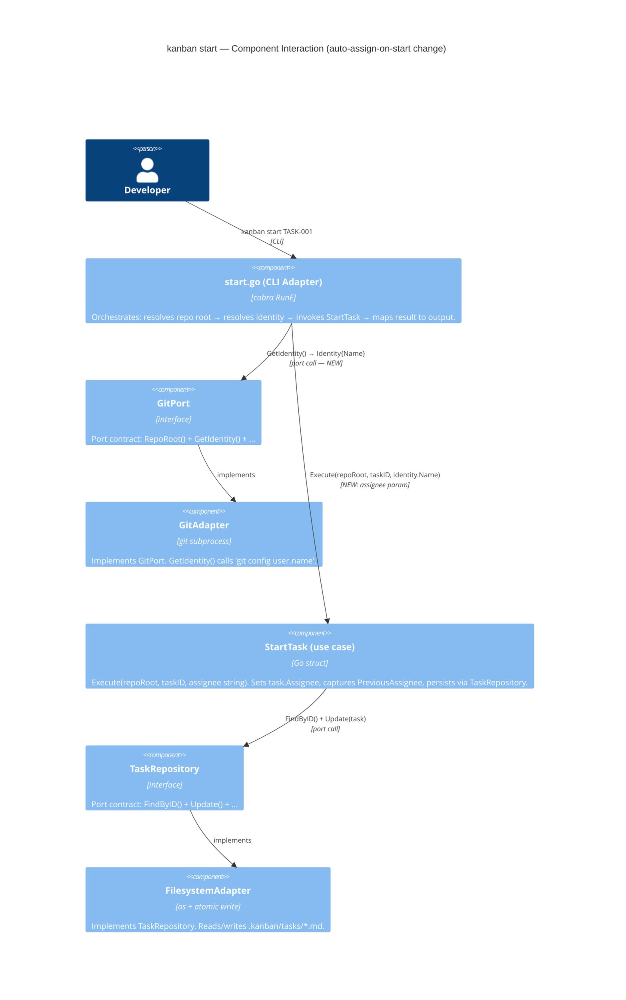

# Architecture Design — auto-assign-on-start

**Feature**: auto-assign-on-start
**Date**: 2026-03-18
**Paradigm**: OOP / idiomatic Go (established in CLAUDE.md + ADR-003)
**Pattern**: Hexagonal Architecture — Ports and Adapters (ADR-001)

---

## Overview

This is a targeted brownfield enhancement. No new components, packages, or port interfaces are introduced. The change modifies two existing files:

| File | Change |
|------|--------|
| `internal/adapters/cli/start.go` | Add `git.GetIdentity()` call before use case; hard fail on error; pass `identity.Name` to use case |
| `internal/usecases/start_task.go` | `Execute` gains `assignee string` param; sets `task.Assignee`; captures `PreviousAssignee` in result |

---

## Quality Attributes Driving Design

| Attribute | Priority | Rationale |
|-----------|----------|-----------|
| Architecture compliance | Highest | Identity resolution must stay in CLI adapter per ADR-001 + ADR-007 |
| Testability | High | Use case must remain testable with in-memory fakes only |
| Behavioural consistency | High | Hard-fail on identity error matches `kanban new` (ADR-007) |
| Minimal change surface | High | Brownfield — one story, two file changes |

---

## C4 System Context Diagram



---

## C4 Container Diagram



---

## C4 Component Diagram — start command flow



---

## Data Flow — happy path (AC-09-1)

```
Developer
  │ kanban start TASK-001
  ▼
start.go
  ├─ git.RepoRoot()            → "/path/to/repo"
  ├─ git.GetIdentity()         → Identity{Name: "Jon", Email: "jon@…"}
  │   └─ ErrGitIdentityNotConfigured → stderr error, osExit(1) ◄─── hard fail (FR-3)
  └─ StartTask.Execute("/path/to/repo", "TASK-001", "Jon")
        ├─ config.Read()       → validates kanban is initialised
        ├─ tasks.FindByID()    → Task{Assignee: "", Status: "todo"}
        ├─ CanTransitionTo()   → true
        ├─ task.Assignee = "Jon"        ◄─── NEW
        ├─ task.Status = "in-progress"
        └─ tasks.Update(task)  → atomic write to .kanban/tasks/TASK-001.md
             └─ returns StartTaskResult{Transitioned: true, PreviousAssignee: ""}
start.go
  ├─ stdout: "Started TASK-001: Fix login bug"
  └─ (no warning — PreviousAssignee is empty)
exit 0
```

---

## Data Flow — reassignment path (AC-09-2)

```
git.GetIdentity()    → Identity{Name: "Bob"}
tasks.FindByID()     → Task{Assignee: "Alice", Status: "todo"}
task.Assignee = "Bob"    ◄─── overwrite
task.Status = "in-progress"
tasks.Update(task)
returns StartTaskResult{Transitioned: true, PreviousAssignee: "Alice"}

start.go:
  stdout: "Started TASK-002: Update docs"
  stdout: "Note: task was previously assigned to Alice"   ◄─── FR-2
exit 0
```

---

## Integration Points

| Component | Change | Impact |
|-----------|--------|--------|
| `start.go` | Add `GetIdentity()` call + hard fail + pass to use case | Mirrors existing pattern in `new.go` |
| `StartTask.Execute` | New `assignee string` param | 1 call site to update (`start.go`) |
| `StartTaskResult` | New `PreviousAssignee string` field | All existing callers unaffected (zero-value is empty string) |
| Existing unit tests | Signature update only | 5 tests need `assignee ""` added to `Execute` calls |
| Acceptance tests | New milestone file for this feature | No changes to existing milestone files |

---

## Reuse vs New

| Decision | Choice | Rationale |
|----------|--------|-----------|
| `GitPort.GetIdentity()` | **Reuse** | Already implemented in `GitAdapter`, already on the port (ADR-007) |
| `ports.ErrGitIdentityNotConfigured` | **Reuse** | Already declared in `ports/errors.go` |
| `domain.Task.Assignee` | **Reuse** | Field already exists in domain model |
| `ports.Identity` struct | **Reuse** | Already in `ports/git.go` |
| Hard-fail pattern on identity error | **Reuse** | Mirrors `new.go` L38-42 verbatim |
| New port interface | **Not needed** | No new port methods required |
| New package | **Not needed** | Change is confined to existing packages |
