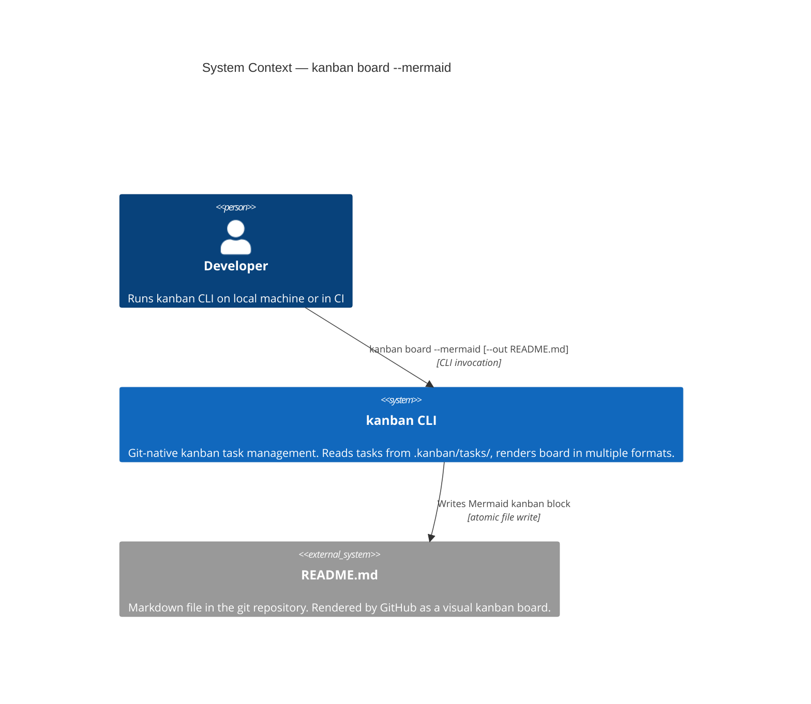
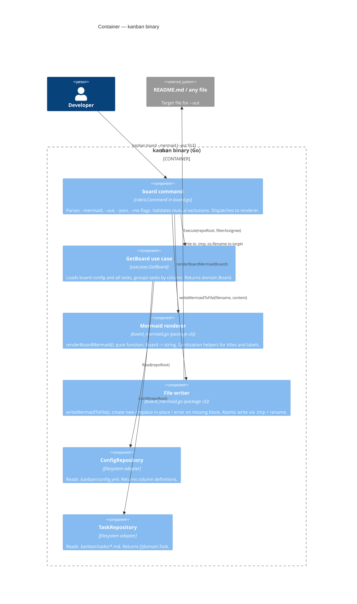

# Architecture Design — board-mermaid-export

## System Overview

`board-mermaid-export` is a brownfield CLI extension. The existing `kanban board` command gains two new flags: `--mermaid` (switches output format to a Mermaid kanban diagram) and `--out FILE` (writes the output into a file instead of stdout). No new domain concepts, ports, or use cases are introduced.

The primary constraint from DISCUSS is NFR-02: rendering logic stays in the CLI adapter. This is consistent with the existing pattern — `printBoardJSON` lives alongside `printBoard` in `internal/adapters/cli/board.go`.

---

## C4 System Context



---

## C4 Container



---

## Component Design

### New file: `internal/adapters/cli/board_mermaid.go` (package `cli`)

Mermaid-specific logic is placed in a dedicated file within the `cli` package rather than appended to `board.go`. `board.go` is currently 178 lines; adding ~150 lines of Mermaid rendering and file-writing logic would compromise readability. The `cli` package already spans multiple files (`board.go`, `add.go`, `edit.go`, etc.) — a dedicated `board_mermaid.go` follows this established convention. The hexagonal boundary is unchanged: the file lives in `internal/adapters/cli`.

**Functions exported within the package:**

| Function | Signature | Notes |
|----------|-----------|-------|
| `renderBoardMermaid` | `(board domain.Board) string` | Pure function — no I/O. Returns a complete fenced Mermaid block. |
| `sanitiseMermaidTitle` | `(s string) string` | Removes/replaces `"`, `[`, `]`, newline. Called per task title. |
| `sanitiseMermaidLabel` | `(s string) string` | Strips characters that break Mermaid `section` header syntax (colon). |
| `writeMermaidToFile` | `(filename, content string) error` | Handles create / in-place replace / missing-block error. Returns typed errors for exit code routing. |

### Modified file: `internal/adapters/cli/board.go`

Add two flags to `NewBoardCommand`:
- `--mermaid bool` — switches output format to Mermaid
- `--out string` — file path; requires `--mermaid`

Add mutual-exclusion checks in `RunE` before rendering (both return exit 2).

---

## Rendering Algorithm

### `renderBoardMermaid(board domain.Board) string`

```
output  = "```mermaid\n"
output += "kanban\n"
for each col in board.Columns:
    output += "  section " + sanitiseMermaidLabel(col.Label) + "\n"
    for each task in board.Tasks[TaskStatus(col.Name)]:
        output += "    " + task.ID + "@{ label: \"" + sanitiseMermaidTitle(task.Title) + "\" }\n"
output += "```\n"
return output
```

### `writeMermaidToFile(filename, content string) error`

```
1. os.Stat(filename)
   → os.IsNotExist: write content atomically to filename; return nil

2. os.ReadFile(filename) → fileBytes

3. Scan lines for fenced Mermaid kanban block:
   - Find line equal to "```mermaid"
   - Within that fence, find line equal to "kanban"
   - Find the closing "```"
   → Not found: return ErrNoKanbanBlock (caller exits 1 with descriptive message)

4. Reconstruct file: lines before opening fence + content + lines after closing fence

5. os.WriteFile(filename+".tmp", reconstructed, 0644)
   os.Rename(filename+".tmp", filename)
   return nil
```

### Sanitisation rules

| Input character | Replacement |
|-----------------|-------------|
| `"` | `'` (straight single quote) |
| `[` | `(` |
| `]` | `)` |
| `\n`, `\r` | ` ` (space) |
| `:` (label only) | ` ` (space) |

---

## Mutual Exclusion Validation

Validation order in `RunE` (before use case execution):

1. `--out` provided without `--mermaid` → `fmt.Fprintln(os.Stderr, "--out requires --mermaid")` + `os.Exit(2)`
2. `--mermaid` and `--json` both provided → `fmt.Fprintln(os.Stderr, "--mermaid and --json are mutually exclusive")` + `os.Exit(2)`

---

## Architectural Compliance

| Rule | Status |
|------|--------|
| `internal/domain` has zero imports from adapters/usecases | Not affected — no domain changes |
| `internal/usecases` has zero imports from adapters | Not affected — no use case changes |
| No adapter imports another adapter | `board_mermaid.go` is in `cli` package, imports `domain` only |
| No new external dependencies | `strings`, `os`, `fmt`, `bytes` — all stdlib |
| Atomic writes | `writeMermaidToFile` uses `.tmp` + `os.Rename` consistent with project pattern |
| Exit code convention | 0=success, 1=runtime error, 2=usage error — enforced explicitly |
| No new ports or use cases | `domain.Board` flows from existing `GetBoard` use case unchanged |
