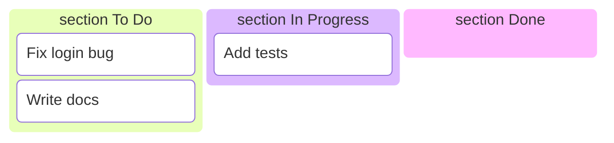

# Data Models — board-mermaid-export

## No New Domain Types

This feature introduces no new types in `internal/domain`. All rendering operates on the existing `domain.Board` type returned by the `GetBoard` use case.

## Existing Types Used

### `domain.Board`

```go
type Board struct {
    Columns         []Column
    Tasks           map[TaskStatus][]Task
    UnassignedCount int
}
```

The Mermaid renderer iterates `Columns` (for ordering) and `Tasks[TaskStatus(col.Name)]` (for task nodes). `UnassignedCount` is not used in Mermaid output.

### `domain.Column`

```go
type Column struct {
    Name  string  // internal key, e.g. "in-progress"
    Label string  // display label, e.g. "In Progress"
}
```

`Label` is used as the Mermaid `section` header (after sanitisation). `Name` is used as the key into `board.Tasks`.

### `domain.Task`

```go
type Task struct {
    ID    string
    Title string
    // ... other fields not used by Mermaid renderer
}
```

Only `ID` and `Title` appear in the Mermaid output. `Title` is sanitised before inclusion.

## Output Representation

The Mermaid diagram is a `string` built by `renderBoardMermaid`. It is not persisted to any domain type — it flows directly to stdout or to `writeMermaidToFile`.

**Example output structure:**

```

```

## Sanitisation Mapping

| Input field | Sanitisation function | Applied before |
|-------------|----------------------|----------------|
| `task.Title` | `sanitiseMermaidTitle` | Embedding in `@{ label: "..." }` |
| `col.Label` | `sanitiseMermaidLabel` | Embedding in `section ...` |

No data is persisted. Sanitisation is a rendering concern only.
