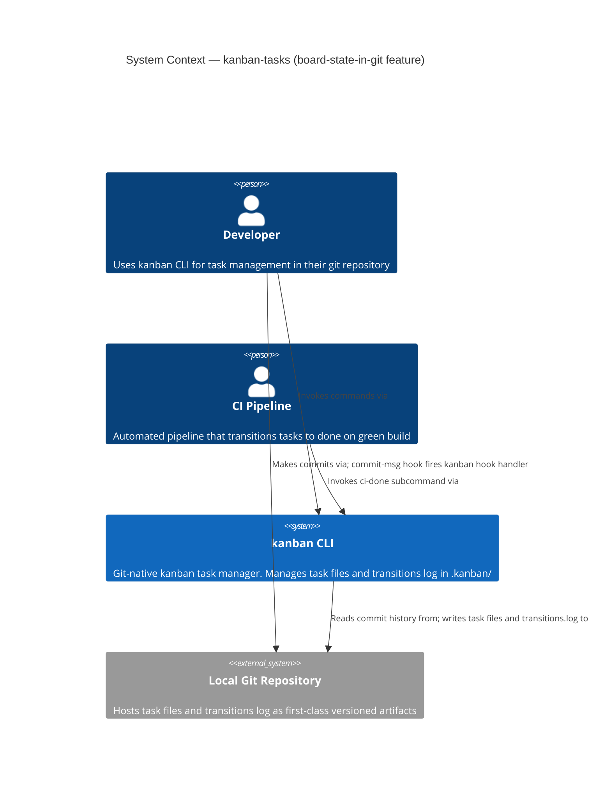
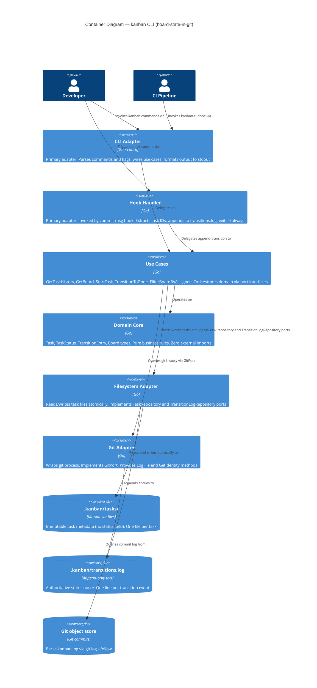
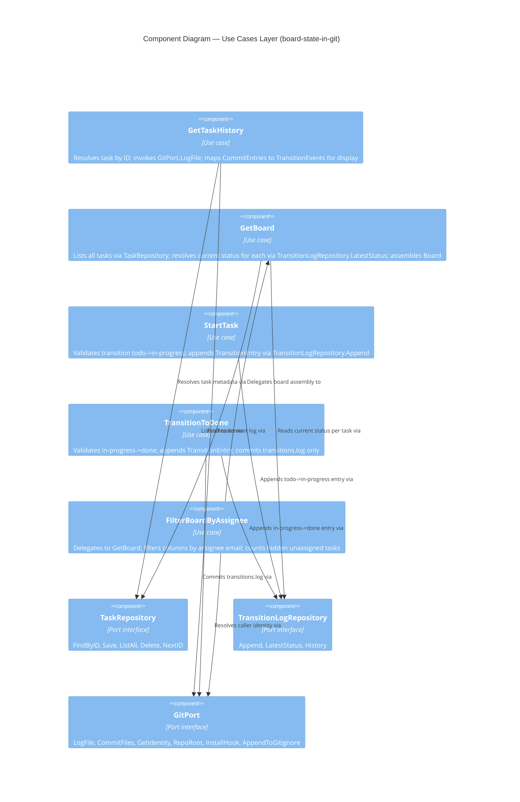

# Architecture Design — board-state-in-git

**Feature**: board-state-in-git
**Date**: 2026-03-18
**Status**: Approved
**Stories**: US-BSG-01, US-BSG-02, US-BSG-03
**Architect**: Morgan (Solution Architect, DESIGN wave)

---

## 1. Feature Summary

This feature replaces the YAML `status:` field in task files with an append-only transitions log at `.kanban/transitions.log`, adds a `kanban log <TASK-ID>` command to display task history sourced from git commit metadata, and adds a `--me` filter to `kanban board`. The result is a fully auditable, immutable state record with no mutable fields in task files.

---

## 2. Quality Attribute Priorities

| Priority | Attribute | Measurable Scenario |
|----------|-----------|---------------------|
| 1 | Maintainability | All new components satisfy go-arch-lint; no new adapter-to-adapter imports introduced |
| 2 | Auditability | Full transition history accessible via `kanban log <TASK-ID>` within 500ms on 1k+ commits |
| 3 | Reliability | Hook execution never exits non-zero; log write failures are silently recovered and logged to `.kanban/hook.log` |
| 4 | Testability | TransitionLogRepository adapter is testable in isolation with `t.TempDir()`; domain types remain pure |
| 5 | Performance | `kanban board` p99 latency unchanged from baseline; `kanban log` completes within 500ms on 1k+ commits |

---

## 3. C4 Diagrams

### 3.1 System Context (L1)



### 3.2 Container Diagram (L2)



### 3.3 Component Diagram (L3) — Use Cases Layer

The use cases layer has five components interacting with four port interfaces; a Component diagram is warranted.



---

## 4. Component Boundaries and Responsibilities

### 4.1 Domain Core (`internal/domain/`)

**Responsibility**: Pure types and business rules. Zero external imports enforced by go-arch-lint.

**New type**:

`TransitionEntry` — represents a single state change event:
- Fields: `Timestamp time.Time`, `TaskID string`, `Author string`, `Trigger string`, `From TaskStatus`, `To TaskStatus`
- Validation rule: `From != To`; both statuses must be valid values; `Timestamp` must not be zero

**Existing types unchanged**: `Task`, `TaskStatus`, `Board`, `Column`, `Transition`, `ValidationError`.

`Task` is modified: the `Status` field is no longer the authoritative source. `GetBoard` resolves status dynamically from `TransitionLogRepository`. The `Status` field on `Task` remains for in-memory assembly of `Board` — it is populated by the use case, not read from the file.

### 4.2 Ports (`internal/ports/`)

**New port**: `TransitionLogRepository`

```
Append(repoRoot string, entry domain.TransitionEntry) error
LatestStatus(repoRoot, taskID string) (domain.TaskStatus, bool, error)
History(repoRoot, taskID string) ([]domain.TransitionEntry, error)
```

Returns `(domain.TaskStatus, bool, error)` from `LatestStatus` where `bool` is false when no entries exist for the task (new task, never transitioned — defaults to "todo").

**Extended port**: `GitPort` — new method added:

```
LogFile(repoRoot, filePath string) ([]CommitEntry, error)
```

`CommitEntry` is a value type in `internal/ports/git.go`:
- Fields: `Hash string`, `Timestamp time.Time`, `AuthorEmail string`, `Message string`

`CommitEntry` is distinct from `TransitionEntry`. The git adapter returns raw commit data; `GetTaskHistory` use case is responsible for interpreting commit messages into transition vocabulary.

**Unchanged ports**: `TaskRepository`, `ConfigRepository`, `EditFilePort` remain as-is. `TaskRepository.Update` continues to exist for non-status field edits (title, priority, etc.).

### 4.3 Use Cases (`internal/usecases/`)

**New use case**: `GetTaskHistory`
- Inputs: `repoRoot string`, `taskID string`
- Output: `TaskHistory` value type containing task title and ordered `[]HistoryEntry`
- `HistoryEntry`: `Timestamp time.Time`, `From TaskStatus`, `To TaskStatus`, `AuthorEmail string`, `Trigger string`
- Behaviour: if `GitPort.LogFile` returns zero entries, returns `TaskHistory` with empty `Entries` (no error); the CLI adapter renders "No transitions recorded yet."
- Does not touch `TransitionLogRepository` — history is sourced entirely from git commit log for US-BSG-01

**Modified use case**: `GetBoard`
- Accepts optional `filterAssignee string` (empty string = no filter)
- Resolves each task's current status by calling `TransitionLogRepository.LatestStatus`; falls back to "todo" when `bool` is false
- Assembles `Board` with dynamically resolved statuses
- When `filterAssignee` is non-empty: omits tasks where `task.Assignee != filterAssignee`; counts omitted tasks where `task.Assignee == ""` and includes count in returned metadata for the CLI to display the warning

**Modified use case**: `StartTask`
- Replaces `TaskRepository.Update(status=in-progress)` with `TransitionLogRepository.Append(todo->in-progress, trigger="manual")`
- Reads `GitPort.GetIdentity().Email` as author

**Modified use case**: `TransitionToDone`
- Replaces `TaskRepository.Update(status=done)` with `TransitionLogRepository.Append(in-progress->done, trigger="ci-done:<sha>")`
- Commits only `.kanban/transitions.log` via `GitPort.CommitFiles`

**Hook handler** (existing, in `internal/adapters/cli/` or a dedicated hook adapter):
- Replaces `TaskRepository.Update(status=in-progress)` with `TransitionLogRepository.Append(todo->in-progress, trigger="commit:<sha>")`
- Reads commit SHA from hook context

### 4.4 Filesystem Adapter (`internal/adapters/filesystem/`)

**New**: `TransitionLogAdapter` implementing `TransitionLogRepository` port.

- `Append`: opens `.kanban/transitions.log` with `O_APPEND|O_CREATE|O_WRONLY`; writes a single line; `fsync`s before close. Line format defined in ADR-011.
- `LatestStatus`: reads file; scans lines in reverse; returns `TaskStatus` from the first matching `TASK-ID` entry found.
- `History`: reads file; collects all lines matching `TASK-ID`; returns ordered slice.
- **File locking**: uses `syscall.Flock(LOCK_EX)` on the file descriptor before write; releases before close. This is advisory locking sufficient for the single-machine, single-repository use case. See ADR-011 for rationale.
- **Task file writes**: `status:` field is no longer written. New task files omit the `status:` field entirely. A comment line in the Markdown body points to transitions.log: `<!-- State managed by .kanban/transitions.log -->`.

### 4.5 Git Adapter (`internal/adapters/git/`)

**Extended**: `GitAdapter` implementing the new `LogFile` method.

- Invokes `git log --follow --format="%H|%aI|%ae|%s" -- <filePath>` (pipe-separated to avoid ambiguity with spaces in subject).
- Parses each output line into `CommitEntry`.
- Returns empty slice (not error) when the file has no commit history.
- `--follow` tracks renames; known edge case documented in ADR-011.

---

## 5. Data Models

See `docs/feature/board-state-in-git/design/data-models.md` for complete field-level specification including transitions.log line format, task file format changes, and TransitionEntry parsing rules.

---

## 6. Integration Patterns

### 6.1 Write Path — Transition Append

All state transitions (manual `kanban start`, commit hook, `kanban ci-done`) converge on the same `TransitionLogRepository.Append` port method. The filesystem adapter serialises to the append-only log. No transition ever mutates a task file's YAML front matter.

```
CLI/Hook/CI  ->  Use Case (StartTask/TransitionToDone/HookHandler)
                     ->  TransitionLogRepository.Append
                             ->  TransitionLogAdapter (O_APPEND|LOCK_EX)
                                     ->  .kanban/transitions.log
```

### 6.2 Read Path — Board Assembly

`GetBoard` reads all task metadata from `TaskRepository` (filesystem), then resolves each task's current status from `TransitionLogRepository.LatestStatus`. These are two sequential reads; no join at the filesystem level.

```
CLI  ->  GetBoard.Execute
             ->  TaskRepository.ListAll  ->  []Task (metadata only)
             ->  TransitionLogRepository.LatestStatus (per task)
             ->  Assemble Board with resolved statuses
```

### 6.3 Read Path — Task Log

`GetTaskHistory` reads task metadata for the title, then delegates to `GitPort.LogFile` for the commit history. Commit messages are parsed in the use case to extract transition vocabulary.

```
CLI  ->  GetTaskHistory.Execute
             ->  TaskRepository.FindByID  ->  Task (title only)
             ->  GitPort.LogFile  ->  []CommitEntry
             ->  Map CommitEntries to HistoryEntries
             ->  Return TaskHistory
```

### 6.4 Commit Scope — CI Done

`TransitionToDone` commits only `.kanban/transitions.log`. It does not touch task files. This narrows the commit surface from "all updated task files" to a single file, reducing merge conflict risk.

---

## 7. Migration Strategy — RQ-4

See ADR-012 for the full migration design. Summary: a `kanban migrate` command reads existing `status:` values from task YAML front matter, synthesises a `TransitionEntry` per task with `trigger="migration"` and `timestamp=file-mtime`, and appends to `.kanban/transitions.log`. The command is idempotent. The `status:` field is retained in task files after migration as a read-only legacy field; it is ignored by `GetBoard` (which reads from the log). A follow-up cleanup pass can strip the field. No auto-migration on startup.

---

## 8. Open Question Resolutions

| RQ | Resolution | Documented In |
|----|-----------|---------------|
| RQ-1 | Space-separated fields; quoted title not included; trigger field uses `commit:<sha7>` or `ci-done:<sha7>` or `manual`; format: `<ISO8601_UTC> <TASK-ID> <from>-><to> <author_email> <trigger>` | ADR-011 |
| RQ-2 | `git log --follow` is reliable for renames within a single branch; cherry-picks and history rewrites can orphan entries. Documented as known limitation; not a blocker for MVP. | ADR-011 |
| RQ-3 | `kanban log --json` deferred to post-MVP. No architecture impact. | wave-decisions.md |
| RQ-4 | `kanban migrate` command; explicit; idempotent; trigger="migration" | ADR-012 |

---

## 9. Architecture Enforcement

**Style**: Hexagonal (Ports and Adapters)
**Language**: Go 1.22+
**Tool**: `go-arch-lint` (already active in CI)

Rules enforced (existing + new):
- `internal/domain` has zero imports from `internal/ports`, `internal/usecases`, or `internal/adapters`
- `internal/usecases` has zero imports from `internal/adapters`
- `internal/adapters/filesystem` does not import `internal/adapters/git`
- `internal/adapters/git` does not import `internal/adapters/filesystem`
- All secondary port dependencies cross via interfaces in `internal/ports`

The new `TransitionLogAdapter` in `internal/adapters/filesystem/` and the extended `GitAdapter` in `internal/adapters/git/` must satisfy these rules without change. go-arch-lint will catch violations at CI time.

---

## 10. Quality Attribute Strategies

### Reliability — Hook Exit 0 Guarantee
`TransitionLogRepository.Append` errors in the hook handler are caught by the existing top-level `recover()` in the hook entry point. Append failures are written to `.kanban/hook.log` and the hook exits 0. This is an extension of the existing guarantee in ADR-004, not a new mechanism.

### Reliability — Atomic Log Append
`O_APPEND` on POSIX systems guarantees that writes smaller than `PIPE_BUF` (4096 bytes on Linux/macOS) are atomic at the kernel level. Each transitions.log line is well under this limit. `Flock(LOCK_EX)` provides advisory locking for processes that do not use O_APPEND directly. Together these prevent torn writes.

### Performance — Board Latency
`TransitionLogRepository.LatestStatus` scans the log from the end for the first matching task ID. For a typical project with dozens of tasks and hundreds of transitions, this is a microsecond-range operation. For projects with thousands of entries over years, the linear scan remains acceptable (transitions.log at 1 million entries ≈ 80 MB; tail-scan of 1 MB reads 12,500 entries). No caching or indexing required for MVP. If performance degrades at scale, an in-memory index can be added to `GetBoard` without changing any port interfaces.

### Maintainability — Single State Source
Removing `status:` from task files eliminates the dual-write pattern that existed when both the YAML field and git history needed to be consistent. The transitions log is the single authoritative source; git history is an audit overlay. This reduces the number of places a status update must be applied from two (YAML + log) to one.

---

## 11. ADR Index (this feature)

| ADR | Title | Action |
|-----|-------|--------|
| ADR-002 | Task File Format | Updated — status field superseded |
| ADR-004 | Git Hook Strategy | Updated — hook appends to log, not task file |
| ADR-005 | CI/CD Integration | Updated — ci-done commits log only |
| ADR-011 | Transitions Log Format | New |
| ADR-012 | Migration Strategy | New |
