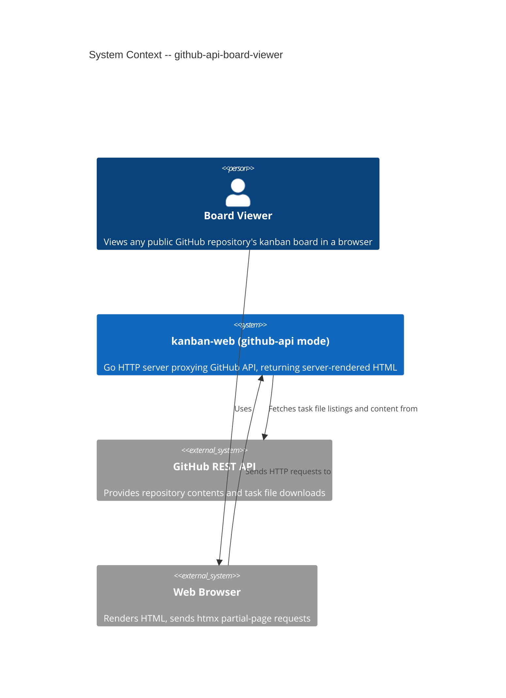
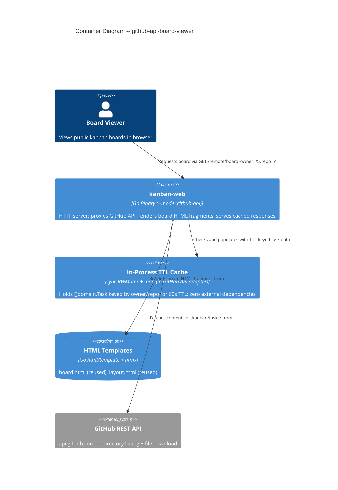

# Architecture Design: github-api-board-viewer

**Date**: 2026-04-03
**Status**: Final
**Wave**: DESIGN
**Feature**: Remote board viewing via GitHub API proxy

---

## 1. System Context

The `github-api-board-viewer` feature extends the existing `kanban-web` binary with a second operating mode. When launched with `--mode=github-api`, the server proxies GitHub REST API calls and returns server-rendered HTML fragments representing any public repository's kanban board. No local git clone is required.

The binary continues to support `--mode=git` for the existing local-clone behaviour. The `--mode` flag has no default; omitting it is a startup error.

### Capabilities Added by This Feature

| Capability | Route | Auth Required |
|---|---|---|
| View remote board by owner/repo | `GET /remote/board?owner=X&repo=Y` | No |
| Inline-edit page title (owner/repo) | htmx partial in `board.html` | No |

All capabilities are read-only. No task creation in `--mode=github-api`.

---

## 2. C4 System Context (L1)



---

## 3. C4 Container (L2)



---

## 4. Component Architecture

### New Components and Their Boundaries

| Component | Package | Responsibility | Depends On |
|---|---|---|---|
| `GitHubAPIPort` | `internal/ports/` | Driven port interface: `ListTasks(owner, repo string) ([]domain.Task, error)` | `internal/domain` |
| GitHub API adapter | `internal/adapters/githubapi/` | Implements `GitHubAPIPort`; fetches directory listing + individual task files; parses YAML front matter; owns TTL cache | `internal/ports`, `internal/domain` |
| `GetRemoteBoard` use case | `internal/usecases/` | Calls `GitHubAPIPort.ListTasks`, maps result to `domain.Board` | `internal/domain`, `internal/ports` |
| Remote board handler | `internal/adapters/web/` | Handles `GET /remote/board`; calls `GetRemoteBoard`; renders board fragment | `internal/usecases`, `internal/ports`, `internal/domain` |
| `cmd/kanban-web/main.go` | `cmd/kanban-web/` | Parses `--mode` flag; fails fast on missing flag; wires appropriate adapters | All adapters, all use cases |

### Existing Components Reused Without Modification

| Component | Reuse |
|---|---|
| `internal/domain/` | Task types, Board type, TaskStatus — unchanged |
| `internal/usecases/GetBoard` | Used only in `--mode=git`; not invoked in `--mode=github-api` |
| `internal/adapters/web/BoardHandler` | Extended to serve remote board route alongside existing board route |
| `internal/adapters/web/templates/board.html` | Reused; page title becomes htmx-editable inline input |
| `internal/adapters/web/templates/layout.html` | Reused unchanged |

### Package Layout After Feature

```
cmd/kanban-web/
  main.go              # Parses --mode flag; wires git or github-api adapters; fails fast

internal/
  domain/              # UNCHANGED
  ports/
    repositories.go    # UNCHANGED
    remote_git.go      # UNCHANGED
    github_api.go      # NEW: GitHubAPIPort interface
  usecases/
    get_board.go       # UNCHANGED (git mode)
    get_remote_board.go  # NEW: GetRemoteBoard use case
  adapters/
    web/
      handler.go       # EXTENDED: adds RemoteBoardHandler
      server.go        # EXTENDED: registers /remote/board route conditionally
    githubapi/         # NEW package
      adapter.go       # Implements GitHubAPIPort; owns TTL cache
```

### Dependency Rule Compliance

```
web adapter (primary)      --> usecases --> ports <-- githubapi adapter (secondary)
                                         ports <-- filesystem adapter (secondary)
                                         ports <-- git adapter (secondary)
cmd/kanban-web/main.go     --> all adapters (wiring only)
```

All dependencies point inward. `internal/adapters/githubapi/` does not import any other adapter package. The web adapter does not import `internal/adapters/githubapi/` — it receives the use case via constructor injection.

---

## 5. Mode Selection and Startup Behaviour

The `--mode` flag gates which adapters are wired and which routes are registered.

| `--mode` value | Adapters wired | Routes active |
|---|---|---|
| `git` | filesystem + git (existing) | `/board`, `/card/{id}`, `/task/new`, `/task`, `/auth/token` |
| `github-api` | githubapi (new) | `/remote/board`, `/healthz` — write routes not registered |
| (omitted) | none — startup fails | — |

Startup failure on missing `--mode` produces: `kanban-web: --mode is required. Use --mode=git or --mode=github-api`.

This logic lives entirely in `cmd/kanban-web/main.go`. The web adapter and use cases have no knowledge of the mode concept.

---

## 6. Data Flow: Remote Board View

```
Browser GET /remote/board?owner=X&repo=Y
  --> web handler (RemoteBoardHandler)
      --> GetRemoteBoard.Execute(owner, repo)
          --> GitHubAPIPort.ListTasks(owner, repo)
              --> githubapi adapter checks TTL cache (sync.RWMutex read lock)
                  [cache HIT, age < 60s]
                    --> return cached []domain.Task
                  [cache MISS or expired]
                    --> GET https://api.github.com/repos/{owner}/{repo}/contents/.kanban/tasks
                        Accept: application/vnd.github.object
                        [404] --> return ErrRepositoryNotFound
                        [200, no .kanban/tasks/] --> return ErrNoBoardFound
                        [403/429] --> return ErrRateLimitExceeded
                    --> for each file entry: GET download_url
                    --> parse YAML front matter into []domain.Task
                    --> write to cache (sync.RWMutex write lock, record timestamp)
                    --> return []domain.Task
          --> map []domain.Task to domain.Board
          --> return domain.Board
      --> render board.html fragment
  --> HTTP 200 + HTML (htmx swaps board area)
```

### Error Rendering

Errors from `GetRemoteBoard` are mapped to user-facing messages in the web handler before rendering. The handler never exposes raw error strings.

| Port error sentinel | HTTP status | Rendered message |
|---|---|---|
| `ErrRepositoryNotFound` | 200 (board area render) | "Repository not found" |
| `ErrNoBoardFound` | 200 (board area render) | "This repository has no kanban board" |
| `ErrRateLimitExceeded` | 200 (board area render) | "GitHub API rate limit exceeded. Try again later." |
| `[]domain.Task{}` (empty slice, no error) | 200 | Three empty columns |

Errors are rendered as HTML fragments (not HTTP error status codes) so htmx can swap them into the board area without special client-side handling.

---

## 7. In-Process TTL Cache Design

The cache is entirely contained within `internal/adapters/githubapi/`. No new dependencies.

### Structure (design, not implementation code)

The adapter holds a map keyed by `"owner/repo"` string. Each entry stores the cached task slice and the time the entry was populated. A `sync.RWMutex` guards all reads and writes.

### Behaviour Contract

- Cache TTL: 60 seconds (configurable via flag `--cache-ttl`, default `60s`)
- On read: acquire read lock; check entry existence and age; return tasks if fresh
- On miss/expiry: release read lock; acquire write lock; re-check (double-checked locking to handle concurrent misses); populate; release write lock
- On GitHub API error: do not populate cache; propagate error to use case
- No background eviction goroutine required; stale entries are replaced on the next read miss

### Zero-Dependency Rationale

`sync.RWMutex` + `map` + `time.Time` are all Go stdlib. No external cache library (e.g., `github.com/patrickmn/go-cache`) is introduced. See ADR-020.

---

## 8. UI Changes: Inline-Editable Page Title

The only template change is in `board.html`. The static page title is replaced with an htmx-enabled inline input.

**Behaviour**:
- Title displays `owner/repo` as styled text with a visual edit cue (pencil icon or underline)
- On click: text becomes an editable `<input>` pair (owner field, repo field)
- On Enter or blur: htmx fires `GET /remote/board?owner=X&repo=Y`
- Server returns board HTML fragment; htmx swaps it into the board area
- URL query string updates to `?owner=X&repo=Y` using `hx-push-url`

No custom JavaScript. All behaviour declared via htmx attributes.

---

## 9. Port Extension: GitHubAPIPort

A new driven port interface is added to `internal/ports/github_api.go`:

**Interface contract** (name and method signature only; implementation is crafter's responsibility):

```
GitHubAPIPort
  ListTasks(owner, repo string) ([]domain.Task, error)
```

**Error sentinels** defined in `internal/ports/` alongside existing `errors.go`:
- `ErrRepositoryNotFound` — GitHub returned 404 for the repo or `.kanban/tasks/` path
- `ErrNoBoardFound` — Repo exists but `.kanban/tasks/` directory absent (200 with no matching path)
- `ErrRateLimitExceeded` — GitHub returned 403 or 429

These sentinels follow the existing error design in `internal/ports/errors.go`.

---

## 10. Technology Stack

All existing technology choices are unchanged. No new external dependencies are introduced.

| Component | Technology | License | Rationale |
|---|---|---|---|
| Language | Go 1.22+ | BSD-3-Clause | Existing codebase |
| HTTP client | `net/http` (stdlib) | BSD-3-Clause | GitHub API calls; no external HTTP client needed |
| Cache concurrency | `sync.RWMutex` (stdlib) | BSD-3-Clause | Reader-writer lock for concurrent board requests; zero new deps |
| Cache storage | `map` + `time.Time` (stdlib) | BSD-3-Clause | In-process TTL; sufficient for single-server deployment |
| Templating | `html/template` (stdlib) | BSD-3-Clause | Existing; reused unchanged |
| Client interactivity | htmx 2.x | BSD-2-Clause | Existing; inline-edit title with zero custom JS |
| Architecture enforcement | go-arch-lint | MIT | Existing CI enforcement; rules extended for new package |

---

## 11. Configuration

New flags added to `kanban-web`:

| Parameter | Flag | Env Var | Default | Description |
|---|---|---|---|---|
| Operating mode | `--mode` | `KANBAN_WEB_MODE` | (none — required) | `git` or `github-api`; startup fails without this |
| Cache TTL | `--cache-ttl` | `KANBAN_WEB_CACHE_TTL` | `60s` | TTL for the in-process GitHub API response cache |
| GitHub API base URL | `--github-api-url` | `KANBAN_WEB_GITHUB_API_URL` | `https://api.github.com` | Overridable for testing against stub servers |

All existing flags from the `kanban-web-view` architecture remain unchanged.

---

## 12. Security Notes

- **Anonymous GitHub API**: All calls use no authentication token. The anonymous rate limit is 60 requests/hour per IP. The TTL cache reduces GitHub API calls to at most 1 per `owner/repo` per 60 seconds.
- **Input validation**: `owner` and `repo` query parameters are validated before use (alphanumeric, hyphens, dots; max 100 chars each) to prevent path injection in the GitHub API URL.
- **No credentials stored or transmitted**: `--mode=github-api` does not involve GitHub PAT, cookies, or CSRF — write routes are not registered.
- **Rate limit transparency**: When GitHub returns 403/429, the user-facing message is rendered in the board area. The server does not retry automatically (retry amplification risk with anonymous tokens).
- **Private repo indistinguishability**: 404 and private-repo 404 are treated identically by design, preventing information disclosure about repo existence.
- **HTTP security headers**: All responses continue to include the headers defined in the kanban-web-view architecture (CSP, HSTS, X-Content-Type-Options, X-Frame-Options, Referrer-Policy). No changes required.

---

## 13. Quality Attribute Strategies

| Attribute | Strategy |
|---|---|
| **Maintainability** | Single new adapter package; existing use case and port patterns followed exactly; no cross-adapter imports |
| **Testability** | `GitHubAPIPort` is an interface; `GetRemoteBoard` use case is testable with a mock port; GitHub API adapter testable with `httptest.NewServer` stub; TTL cache testable with injected clock |
| **Performance** | TTL cache eliminates redundant GitHub API calls within 60s window; server-rendered HTML fragments minimise payload size |
| **Reliability** | GitHub API errors mapped to user-facing messages; no panic paths; rate limit errors rendered gracefully |
| **Security** | Anonymous API only; input validation on owner/repo params; no credentials in this mode |
| **Operability** | Mode flag makes operational intent explicit at startup; misconfiguration fails fast with a clear message |

---

## 14. Architectural Enforcement

`go-arch-lint` rules are extended:

- `internal/adapters/githubapi/` must not import `internal/adapters/web/`, `internal/adapters/cli/`, `internal/adapters/filesystem/`, or `internal/adapters/git/`
- `internal/adapters/githubapi/` may only import `internal/ports/` and `internal/domain/`
- `internal/usecases/` must not import `internal/adapters/githubapi/`
- `cmd/kanban-web/` is the sole package that imports both `internal/adapters/githubapi/` and `internal/adapters/web/`

---

## 15. External Integration Annotations

**Contract tests recommended for GitHub REST API** — consumer-driven contracts (e.g., Pact with pact-go) to detect breaking changes before production.

| External Service | API Type | What We Consume |
|---|---|---|
| GitHub REST API | REST | `GET /repos/{owner}/{repo}/contents/{path}` — directory listing with `download_url` per file |
| GitHub CDN | HTTPS file download | `download_url` values from the contents response — raw file content |

The contents endpoint shape (specifically: array of objects with `name`, `download_url`, `type`) is the primary contract boundary. A consumer contract test verifying that shape will catch GitHub API version changes before they reach production.

---

## 16. Story-to-Component Traceability

| Scenario | Components Involved |
|---|---|
| S1: Valid repo with tasks renders board | `RemoteBoardHandler`, `GetRemoteBoard`, `GitHubAPIPort`, `githubapi.Adapter`, `board.html` |
| S2: Valid repo, no tasks — empty columns | Same as S1; `GetRemoteBoard` returns `domain.Board` with empty task maps |
| S3: Invalid owner | `githubapi.Adapter` returns `ErrRepositoryNotFound`; handler renders "Repository not found" fragment |
| S4: Valid owner, invalid repo | Same as S3 |
| S5: Private repo (404) | Same as S3 — indistinguishable by design |
| S6: No `.kanban/tasks/` folder | `githubapi.Adapter` returns `ErrNoBoardFound`; handler renders "This repository has no kanban board" |
| S7: Rate limit exceeded | `githubapi.Adapter` returns `ErrRateLimitExceeded`; handler renders rate limit message |
