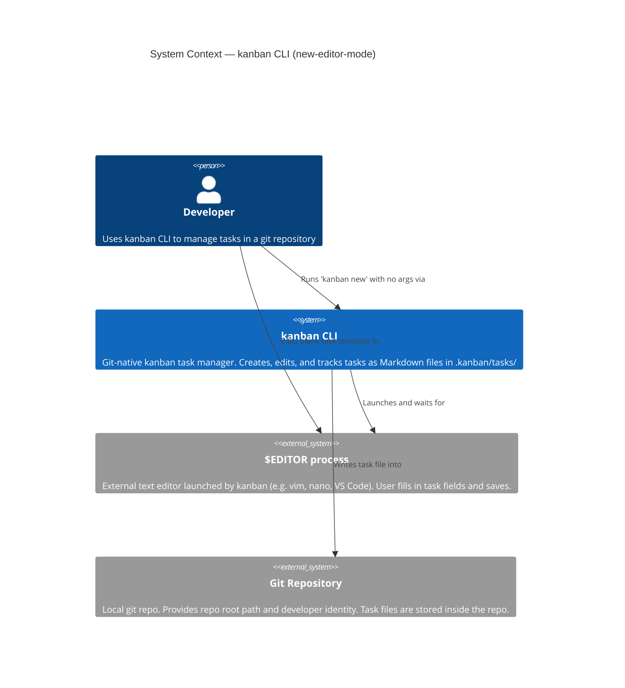
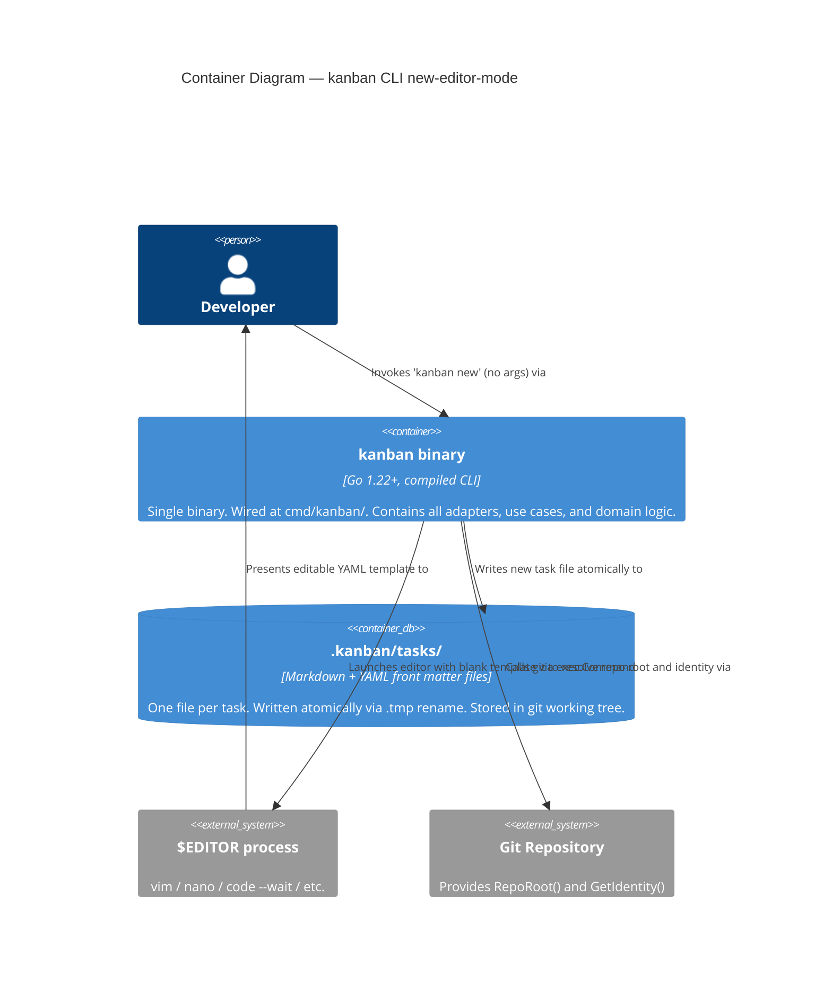
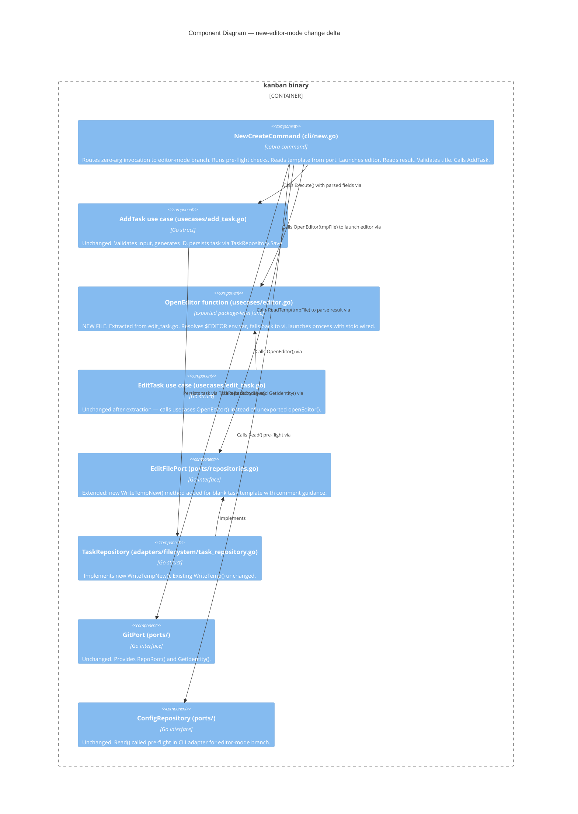

# Architecture Design — new-editor-mode

**Feature**: `kanban new` with no arguments launches `$EDITOR` with a blank task template
**Wave**: DESIGN
**Date**: 2026-03-22
**Architect**: Morgan (nw-solution-architect)

---

## 1. System Context

### 1.1 Scope

This design covers the brownfield addition of editor-mode to the existing `kanban new` command. The existing hexagonal architecture, Go 1.22+ language choice, and package layout are unchanged. The design describes only the delta — what changes, what is added, and what must not change.

### 1.2 C4 Level 1 — System Context



### 1.3 C4 Level 2 — Container



### 1.4 C4 Level 3 — Component (new-editor-mode delta)

This diagram focuses on the internal component interactions for the zero-argument branch of `kanban new`. Components that are unchanged from the existing system are shown in grey notation for context only.



---

## 2. Open Item Resolutions

### OI-01: Sharing Strategy for `openEditor()`

**Decision**: Option B — extract to `internal/usecases/editor.go` as an exported package-level function `OpenEditor(filePath string) error`.

**Rationale**: Option B is the smallest change that satisfies WD-03 (no duplication) while remaining architecturally clean. `openEditor()` is already a use-case concern (it is not domain logic and not an adapter); it belongs in the `usecases` package. Exporting it as `OpenEditor` makes it accessible to both `EditTask` and the new editor-mode branch in `new.go` without leaking it beyond the package in a surprising way — any caller in the same package or in the CLI adapter can reference `usecases.OpenEditor()`.

Option A (export from `edit_task.go` in place) does the same thing but leaves the function co-located in a file named after a different use case, making it harder to discover. Option B gives the function its own file and clear ownership.

Option C (EditorPort interface) adds an interface and injection site for a single three-line function with no meaningful testability benefit — `openEditor` calls `exec.Command` which is already excluded from unit tests by convention; the value of an interface here is negligible and the overhead is real.

**Files affected**:
- `internal/usecases/editor.go` — NEW: contains `OpenEditor(filePath string) error`
- `internal/usecases/edit_task.go` — CHANGE: replace call to `openEditor(tmpFile)` with `OpenEditor(tmpFile)` (one line)
- `internal/adapters/cli/new.go` — CHANGE: calls `usecases.OpenEditor(tmpFile)` in editor-mode branch

See ADR-014.

---

### OI-02: `WriteTemp` with zero-value `domain.Task{}`

**Finding**: The existing `WriteTemp` in `internal/adapters/filesystem/task_repository.go` uses the `editFields` struct with YAML marshal. A zero-value `domain.Task{}` produces valid YAML with empty string fields for `title`, `priority`, `assignee`, `description`, and an empty `due` field. It does NOT panic.

**However**, two problems exist for the new-task case:

1. **`due` field**: WD-01 mandates that the blank template must NOT include a `due` field. The existing `WriteTemp` always includes `due` in the YAML output (the `editFields` struct has `Due string yaml:"due"`). Even with `task.Due == nil`, the marshalled output includes `due: ""`.

2. **No comment guidance**: WD-04/OI-04 mandates that the blank template include comment guidance (at minimum `# title is required`). The existing `WriteTemp` emits no comments.

**Decision**: A new method `WriteTempNew() (string, error)` is added to `EditFilePort`. The filesystem adapter implements it. `WriteTemp` is left entirely unchanged (it is used by `EditTask` and must not change).

---

### OI-03: Config Pre-flight Check Placement

**Decision**: In the zero-argument (editor-mode) branch of `new.go RunE`, `config.Read(repoRoot)` is called directly from the CLI adapter before `editor.WriteTempNew()`. This is consistent with hexagonal architecture: the CLI adapter (primary adapter) holds references to both `ConfigRepository` and `EditFilePort`; calling a port method from a CLI adapter is a normal driving-port interaction. The use case (`AddTask.Execute`) still calls `config.Read` internally for the inline-title path — this remains unchanged.

This placement satisfies WD-04: all pre-flight checks (git repo, git identity, kanban init) run before the editor opens.

---

### OI-04: Template Comment Lines

**Decision**: The `WriteTempNew()` method (see OI-02) produces a YAML file that includes comment lines. The file omits the `due` field (WD-01) and includes a `# title is required` comment above the title field. Additional optional-field comments indicate that empty values are acceptable. `ReadTemp` is already comment-safe: `yaml.Unmarshal` ignores YAML comment lines, so no changes to `ReadTemp` are needed.

---

## 3. Component Boundaries

### What Changes

| Component | Location | Change |
|-----------|----------|--------|
| `NewCreateCommand` | `internal/adapters/cli/new.go` | Add zero-arg branch in `RunE`: pre-flight -> `WriteTempNew` -> `OpenEditor` -> `ReadTemp` -> title validation -> `AddTask.Execute`. Receives `EditFilePort` as new constructor parameter. |
| `EditFilePort` | `internal/ports/repositories.go` | Add `WriteTempNew() (string, error)` method to the interface. |
| `TaskRepository` (filesystem) | `internal/adapters/filesystem/task_repository.go` | Implement `WriteTempNew()`: produces blank YAML with comment guidance, omits `due` field. |
| `usecases/editor.go` | `internal/usecases/editor.go` | NEW FILE: exports `OpenEditor(filePath string) error`. |
| `usecases/edit_task.go` | `internal/usecases/edit_task.go` | One-line change: `openEditor(tmpFile)` -> `OpenEditor(tmpFile)`. Remove the now-unused unexported function. |

### What Does NOT Change

| Component | Reason |
|-----------|--------|
| `AddTask` use case | Unchanged. Called with populated `AddTaskInput` by the CLI adapter; its own validation and `config.Read` still run inside `Execute`. |
| `EditTask` use case | Substantively unchanged. Only the internal call site changes from `openEditor` to `OpenEditor`. |
| `TaskRepository.WriteTemp` | Unchanged. Used exclusively by `EditTask`. |
| `TaskRepository.ReadTemp` | Unchanged. Shared by both edit and new-editor paths. |
| `domain/` | Unchanged. No new domain types. |
| `GitPort` | Unchanged. |
| `ConfigRepository` | Unchanged. |
| Wiring (`cmd/kanban/`) | `NewCreateCommand` gains `EditFilePort` parameter — wiring site updates to pass it. |

---

## 4. Integration Patterns

### Synchronous, in-process

All interactions are synchronous in-process function calls. There are no async patterns, message queues, or network calls. The only out-of-process interaction is launching `$EDITOR` via `exec.Command`, which blocks until the editor exits — identical to the existing `kanban edit` flow.

### Execution Flow — Zero-arg Branch

```
kanban new (no args)
  └─ cli/new.go RunE (zero-arg branch)
       ├─ git.RepoRoot()                         [pre-flight]
       ├─ git.GetIdentity()                      [pre-flight]
       ├─ config.Read(repoRoot)                  [pre-flight — ErrNotInitialised -> exit 1]
       ├─ editor.WriteTempNew()                  [produce blank template with comments]
       ├─ defer os.Remove(tmpFile)
       ├─ usecases.OpenEditor(tmpFile)           [block until editor exits]
       ├─ editor.ReadTemp(tmpFile)               [parse YAML]
       ├─ title == "" -> exit 2                  [validation — WD-02]
       └─ usecases.NewAddTask(config, tasks).Execute(repoRoot, input)
            ├─ domain.ValidateNewTask(title, nil)
            ├─ config.Read(repoRoot)            [redundant but harmless — existing path]
            ├─ tasks.NextID(repoRoot)
            ├─ tasks.Save(repoRoot, task)       [atomic .tmp -> rename]
            └─ return domain.Task
       └─ fmt.Printf("Created %s: %s\n", ...)  [identical output to inline path]
```

### No External Integrations

This feature has no external API integrations. No contract test annotation required.

---

## 5. Data Models

No new domain types. The feature reuses existing types throughout:

- `domain.Task` — zero-value passed to `WriteTempNew` is not used; the method takes no arguments (see Section 6)
- `ports.EditSnapshot` — returned by `ReadTemp`; used to populate `usecases.AddTaskInput`
- `usecases.AddTaskInput` — populated from `EditSnapshot` fields plus `git.GetIdentity().Name`

The blank template YAML produced by `WriteTempNew` contains:

```yaml
# title is required — save with a non-empty title to create the task
title: ""
# optional fields — leave blank to skip
priority: ""
assignee: ""
description: ""
```

The `due` field is absent (WD-01). The `ReadTemp` parser uses `yaml.Unmarshal` which is comment-safe — comment lines are silently ignored.

---

## 6. Port Interface Contract — `EditFilePort` Addition

The `EditFilePort` interface in `internal/ports/repositories.go` gains one method:

```
WriteTempNew() (string, error)
```

Contract: produces a temporary YAML file pre-populated with a blank task template including comment guidance. The `due` field is omitted. Returns the path to the temp file. The caller is responsible for removing the file (via `defer os.Remove`).

`WriteTemp(task domain.Task)` remains on the interface unchanged. Both methods are implemented by `TaskRepository` in the filesystem adapter.

---

## 7. Quality Attributes

### Maintainability
- `openEditor` extracted to `usecases/editor.go` — single canonical location, both use cases reference it
- `WriteTemp` (edit path) and `WriteTempNew` (new path) are separate methods with clear intent; no conditional flag parameter that would add cognitive load
- Architecture rules enforced by `go-arch-lint` (already active in CI) — no new rules needed

### Testability
- `WriteTempNew` is on the `EditFilePort` interface — acceptance tests can mock it or use the real filesystem adapter with `t.TempDir()`
- `OpenEditor` is testable via the existing acceptance-test pattern: compiled binary invoked as subprocess with `EDITOR` set to a script that writes a known file and exits
- Title validation (empty -> exit 2) is testable end-to-end by setting `EDITOR` to a script that writes an empty title and asserting exit code 2

### Reliability
- Pre-flight checks (git repo, git identity, kanban init) run before editor opens — no wasted editor session on misconfigured environment (WD-04)
- Atomic write via `TaskRepository.Save` (.tmp -> rename) — unchanged and enforced
- `defer os.Remove(tmpFile)` ensures temp file cleanup regardless of error path

### Usability
- Comment guidance in blank template reduces user error for first-time users (KPI-1: optional field population rate)
- Identical success output to inline path (WD-05) — scripts parsing output do not need path detection

---

## 8. Architecture Enforcement

Style: Hexagonal (Ports and Adapters)
Language: Go
Tool: `go-arch-lint` (already active, YAML config in project)

Rules to enforce (unchanged from existing, verified compliant for this feature):
- `internal/domain` has zero imports from `internal/ports`, `internal/usecases`, or `internal/adapters`
- `internal/usecases` has zero imports from `internal/adapters`
- No adapter package imports another adapter package
- All secondary port dependencies cross via interfaces in `internal/ports`

New file `internal/usecases/editor.go` is in the `usecases` package — it imports `os` and `os/exec` (stdlib only). No architecture rule violation.

---

## 9. Deployment

No deployment change. The feature is an additive change to an existing single binary. The binary continues to be distributed via goreleaser (GitHub Releases, Homebrew tap, `go install`) per ADR-005. No new runtime dependencies.
