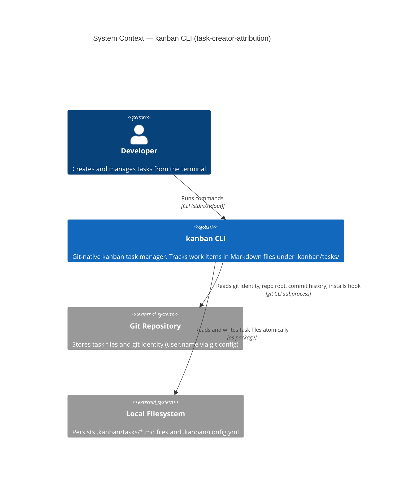
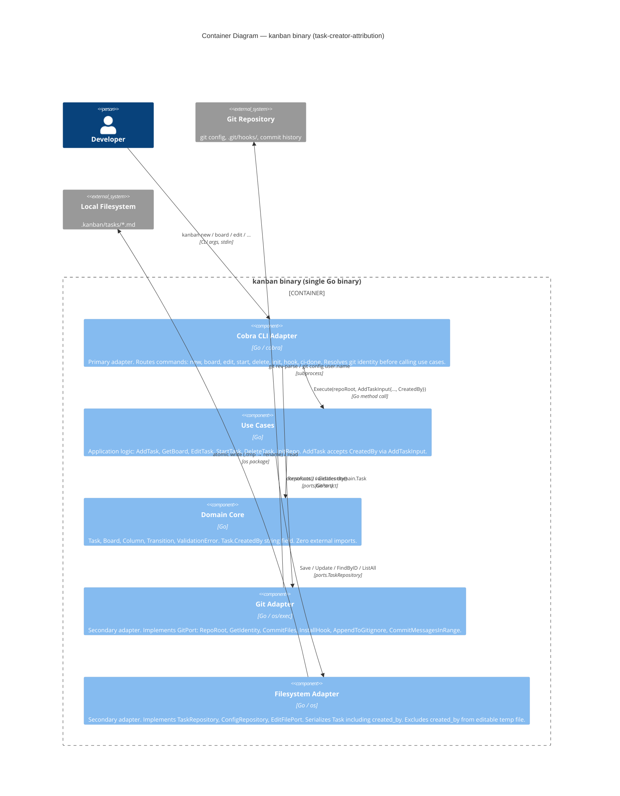
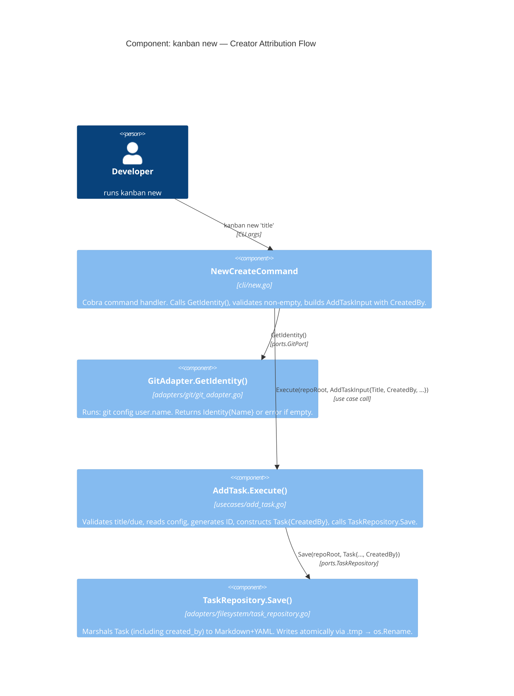

# Architecture Design — task-creator-attribution

## Overview

The `task-creator-attribution` feature adds automatic creator capture to `kanban new` and
surfaces the creator on `kanban board`. It integrates into the existing hexagonal architecture
(ADR-001) without introducing new packages or new architectural patterns. All changes are
additive: a new port method, a new domain field, extended serialization, and updated display.

**Paradigm**: Object-Oriented (Go idiomatic — existing project standard per CLAUDE.md)
**Pattern**: Hexagonal Architecture / Ports-and-Adapters (existing — ADR-001)
**No new packages required.**

---

## C4 Level 1 — System Context



---

## C4 Level 2 — Container Diagram



---

## C4 Level 3 — Component: kanban new with Creator Attribution

This diagram shows the precise execution path for `kanban new` after this feature ships.



---

## Integration Points with Existing Components

| Component | Change | Nature |
|-----------|--------|--------|
| `internal/domain/task.go` | Add `CreatedBy string` to `Task` struct | Additive — plain field, no imports |
| `internal/ports/git.go` | Add `Identity` type + `GetIdentity() (Identity, error)` to `GitPort` | Additive — new method on existing interface |
| `internal/usecases/add_task.go` | Add `CreatedBy string` to `AddTaskInput`; set `task.CreatedBy` in `Execute` | Additive — existing callers unaffected (zero-value = empty string) |
| `internal/adapters/filesystem/task_repository.go` | Add `created_by` to `taskFrontMatter`; update `marshalTask`/`unmarshalTask` | Additive — backward compatible (missing field → empty string) |
| `internal/adapters/git/git_adapter.go` | Implement `GetIdentity()` | Additive — compile-time check enforces coverage |
| `internal/adapters/cli/new.go` | Call `GetIdentity()` before use case; guard on empty name | Modification — error path added before existing flow |
| `internal/adapters/cli/board.go` | Add `CreatedBy` to board row + JSON output | Modification — display-only, no logic change |

---

## Dependency Rule Compliance

The dependency rule (all arrows point inward toward domain) is preserved:

```
cli/new.go
  → ports.GitPort.GetIdentity()          [existing boundary]
  → usecases.AddTaskInput.CreatedBy      [existing boundary]

usecases/add_task.go
  → domain.Task.CreatedBy                [existing boundary]
  → ports.TaskRepository.Save            [existing boundary]

adapters/filesystem
  → domain.Task.CreatedBy                [existing boundary, read direction]

adapters/git
  → ports.Identity                       [new type, lives in ports]
```

**`internal/domain` has zero new imports.** `CreatedBy string` is a plain field.
**`internal/usecases` has zero new imports from `internal/adapters`.**
**No adapter imports another adapter.**

---

## Identity Validation Rule

**Pre-condition**: `git config user.name` must return a non-empty, non-whitespace-only string.

- `GitAdapter.GetIdentity()` trims the output of `git config user.name`. If the result is empty,
  it returns `ErrGitIdentityNotConfigured` (not an `Identity` with empty `Name`).
- The CLI adapter (`cli/new.go`) checks for this error and exits 1 with the setup instructions
  message **before** any use case call or file write.
- There is zero tolerance for an empty `created_by` on a newly created task. The error path
  (AC-03-1, AC-03-2) is the enforcement mechanism.

This rule lives in the adapter, not the domain. The use case trusts that any non-empty
`AddTaskInput.CreatedBy` it receives is valid.

---

## Identity Resolution: Pre-Condition Guard Pattern

The CLI adapter applies a pre-condition guard before invoking the use case — a pattern
already established in `new.go` for the `RepoRoot` check. Identity resolution follows
the same pattern:

```
1. git.RepoRoot()         → error → exit 1 "Not a git repository"
2. git.GetIdentity()      → error/empty → exit 1 "git identity not configured — run: ..."
3. uc.Execute(...)        → error → exit per error type
```

This keeps the use case clean (no git concerns) and the error handling centralized in the
adapter layer where it belongs under hexagonal architecture.

---

## Immutability Mechanism

Creator immutability is enforced by **structural exclusion** — the simplest possible
mechanism that satisfies the requirement:

- `editFields` struct in `filesystem/task_repository.go` does **not** include `created_by`
- `WriteTemp` writes only `editFields` — `created_by` never enters the temp file
- `applyEditFields` in `edit_task.go` copies only the fields in `EditSnapshot` back to the task
- Since `EditSnapshot` has no `CreatedBy` field, the value from the original `FindByID` call
  is carried through `applyEditFields` unchanged and written back by `Update`

No domain-level enforcement is needed. The architecture boundary guarantees immutability.

---

## Backward Compatibility

- Task files without `created_by` in front matter are parsed by `unmarshalTask` with `CreatedBy = ""`
- `kanban board` renders `--` for any task where `CreatedBy == ""`
- `kanban board --json` emits `"created_by": ""` for such tasks
- No migration step required. No data loss.
