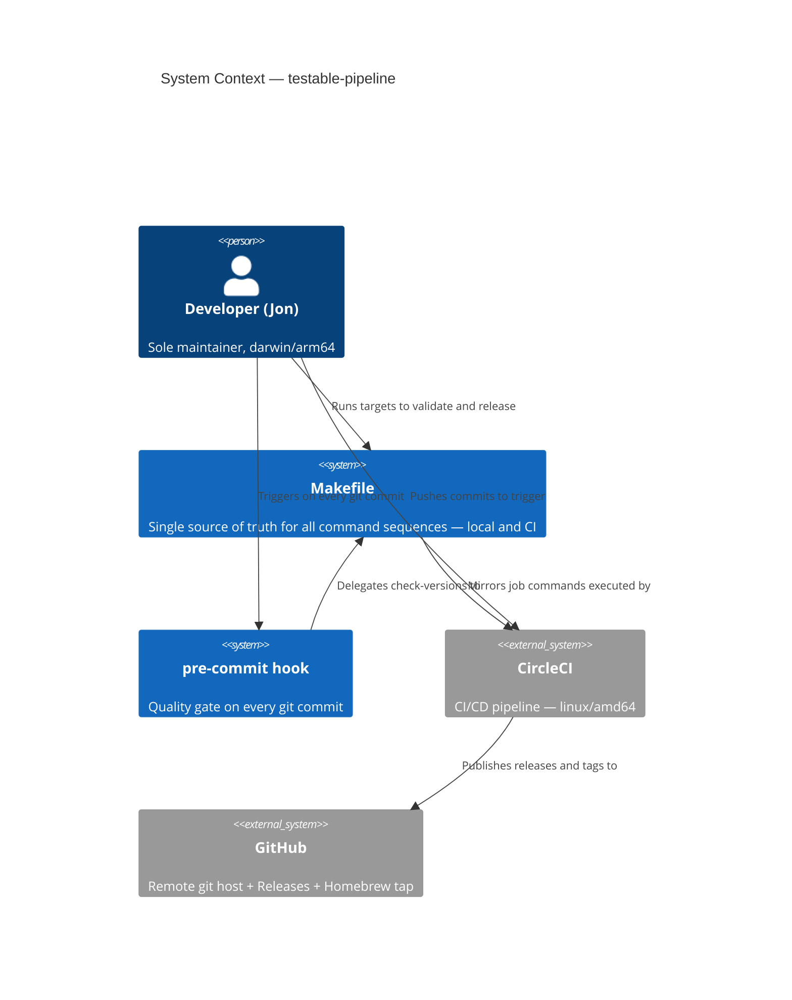
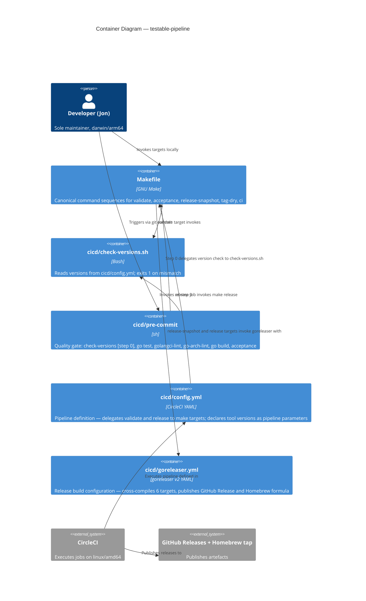

# Architecture Design — testable-pipeline

**Feature**: testable-pipeline
**Wave**: DESIGN
**Date**: 2026-03-18
**Status**: Complete — peer review approved

---

## 1. System Context

### Problem Summary

The developer (Jon) has been using live CI pushes as the primary test environment for pipeline configuration changes. Five git-log-evidenced failure classes, all in tool install and version steps, produce spurious GitHub Releases and a 5–15 minute feedback loop. The architectural response is a parity contract: a Makefile that acts as the single source of truth for both local and CI execution.

### Quality Attribute Priorities (from DISCOVER + DISCUSS waves)

| Attribute | Priority | Evidence |
|-----------|----------|----------|
| Testability | Critical | Primary pain: no local equivalent for CI steps |
| Maintainability | High | Single source of truth for command sequences |
| Reliability | High | 5 ci: fix commits per period; spurious releases |
| Operational Simplicity | High | Single developer; tool overhead must be minimal |
| Performance (feedback loop) | Medium | KPI-1: < 2 min local validation; KPI guardrail: < 90s pre-commit |

---

## 2. C4 System Context (L1)



---

## 3. C4 Container Diagram (L2)



---

## 4. Execution Model

The Makefile is the parity contract between local and CI execution. Every command sequence is defined once in the Makefile and invoked by both environments.

```
Local dev:
  git commit
    → cicd/pre-commit (pre-commit hook)
        → [0/5] cicd/check-versions.sh   ← exits 1 on version mismatch
        → [1/5] go test ./...
        → [2/5] golangci-lint run
        → [3/5] go-arch-lint check        ← restored (was commented out)
        → [4/5] go build
        → [5/5] go test ./tests/acceptance/...

  make validate
    → cicd/check-versions.sh
    → go mod download
    → go-arch-lint check
    → go vet ./...
    → golangci-lint run
    → go test ./internal/...
    → go build -o kanban ./cmd/kanban

  make acceptance
    → go test ./tests/acceptance/... (with KANBAN_BINARY set)

  make ci
    → make validate, then make acceptance

  make release-snapshot
    → goreleaser release --snapshot --config cicd/goreleaser.yml --clean

  make tag-dry
    → go-semver-release release --dry-run ...

CircleCI:
  validate-and-build job → make validate
  acceptance job         → make acceptance
  tag job                → go-semver-release (retains direct invocation — needs secrets + git history)
  release job            → make release
```

### Why pre-commit does not delegate to `make validate`

The pre-commit hook builds the binary to a `mktemp` path (not `./kanban`) so it does not pollute the working directory. The `make validate` target builds to `./kanban`. They share the same validation steps but diverge in binary output path. This is an accepted design difference — the pre-commit hook's test-isolation pattern is more important than exact target delegation. The `make validate` command sequence is kept in exact parity with CI; the pre-commit hook is kept in exact parity with the same command list.

---

## 5. Open Decision Resolutions

Three open decisions (OD-01, OD-02, OD-03) were handed from DISCUSS to DESIGN.

### OD-01: [skip release] implementation mechanism

**Decision**: Shell `if` guard inside the `tag` and `release` job scripts (Option 3 from DISCUSS technical notes).

**Rationale**: CircleCI's `<< pipeline.git.commit_message >>` parameter is available only in API-triggered pipelines; it is not populated from push events. The shell guard reads `git log -1 --pretty=%B` at job runtime and is both reliable and simpler. It does not skip the job (job still appears in CircleCI UI as green), but exits 0 early — this is acceptable and provides a cleaner audit trail than a filtered-out job.

See ADR-008 for the full decision record.

### OD-02: Makefile version sourcing

**Decision**: No hardcoding required. `cicd/check-versions.sh` already reads versions dynamically from `cicd/config.yml` using `awk`. The Makefile `validate` target invokes `check-versions.sh` as its first step. Any version drift between local tools and `cicd/config.yml` parameters is caught there.

**Finding from existing system analysis**: `cicd/check-versions.sh` already exists and is fully implemented. It reads `go-image-version`, `golangci-lint-version`, `go-arch-lint-version`, `go-semver-release-version`, and `goreleaser-version` from `cicd/config.yml`. No new tool or inline version comments are needed in the Makefile.

### OD-03: Pre-commit step numbering

**Decision**: Six-step renumbering: `[0/5]` for check-versions (prerequisite), `[1/5]`–`[5/5]` for the existing steps. The `[0/5]` label communicates that check-versions is a prerequisite gate, not a numbered quality step, which matches its semantics — it gates whether the other steps can be trusted.

---

## 6. Component Architecture

Detailed component breakdown is in `component-boundaries.md`.

| Component | Type | Change | Rationale |
|-----------|------|--------|-----------|
| Makefile | New file | Create | Single source of truth; no current equivalent |
| cicd/config.yml | Existing | Modify | Delegate validate and release to `make`; add install-goreleaser command; add [skip release] guards |
| cicd/pre-commit | Existing | Modify | Uncomment go-arch-lint (6 lines); add check-versions.sh as step 0 |
| cicd/check-versions.sh | Existing | No change | Already fully implemented; already reads versions from config.yml |
| cicd/goreleaser.yml | Existing | No change | No modification required |

---

## 7. Quality Attribute Strategies

### Testability

The Makefile is the primary testability mechanism. Each target is independently invokable, allowing isolation of failures before a push. `make validate` provides sub-2-minute feedback on the validate-and-build class. `make release-snapshot` provides feedback on goreleaser configuration without secrets.

### Maintainability

Single source of truth principle: command sequences are defined once in the Makefile. CI jobs call `make <target>` — they do not duplicate command logic. When a command changes (e.g., a lint flag), it changes in one place. Inline comments in each Makefile target reference the CI job it mirrors and document known gaps.

### Reliability

The `[skip release]` guard gives the developer a safe path for CI-affecting changes. The goreleaser cache (`install-goreleaser` command in CI) eliminates the current `curl | bash` on every run. Cache keys are version-pinned — a version bump automatically invalidates the cache and re-installs.

### Operational Simplicity

All changes are to existing CI/CD files. No new services, no new dependencies, no new infrastructure. The Makefile is a standard POSIX Makefile with no special tooling required.

---

## 8. Architecture Enforcement

This feature is CI/CD configuration, not application code. The hexagonal architecture enforcement already in place via `go-arch-lint` is unchanged and unaffected. The Makefile `validate` target continues to invoke `go-arch-lint check` as it mirrors the CI job.

Style: Hexagonal (existing, not modified by this feature)
Tool: go-arch-lint (existing, not modified by this feature)
Pre-commit: go-arch-lint check is restored to active status (US-TP-03)

---

## 9. External Integrations

This feature has no new external API integrations. Existing integrations (GitHub Releases API, Homebrew tap) are unchanged. No contract testing annotation required.

---

## 10. Delivery Sequence

Per DISCUSS wave delivery order: US-TP-03 → US-TP-02 → US-TP-04 → US-TP-01

Rationale for this sequence:
1. **US-TP-03** first: smallest change (uncomment 6 lines + add 3 lines), immediately closes the arch-lint divergence class, no dependencies.
2. **US-TP-02** second: creates the Makefile; includes all targets needed for other stories.
3. **US-TP-04** third: CI config change for [skip release] guard; independent of Makefile.
4. **US-TP-01** fourth: adds install-goreleaser cache command to CI; `make release-snapshot` target already created in US-TP-02.

---

## 11. ADR Index (this feature)

| ADR | Title | Status |
|-----|-------|--------|
| ADR-008 | Makefile as CI command interface | Accepted |
| ADR-009 | [skip release] shell guard implementation | Accepted |
| ADR-010 | goreleaser caching via go install | Accepted |
