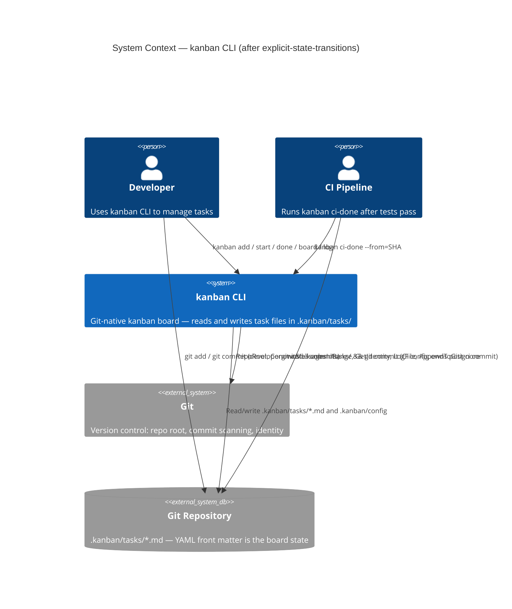
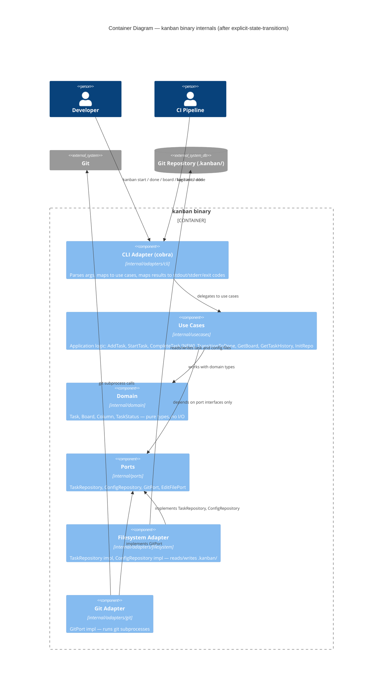

# Architecture Design — explicit-state-transitions

**Feature**: Explicit State Transitions
**Date**: 2026-03-22
**Architect**: Morgan (nw-solution-architect)
**Paradigm**: OOP with interfaces as ports (Go idiomatic hexagonal — unchanged)

---

## Architectural Strategy

This feature is a **reduction and simplification** of the existing hexagonal architecture. The `TransitionLogRepository` port and its adapter are removed entirely. No new architectural patterns are introduced. The dependency rule is preserved: all arrows continue pointing inward toward the domain core.

The key shift: **state source moves from an append-only log back to YAML front matter in task files**. This eliminates a secondary state store and makes the system's state model self-evident — a task file's content IS its state.

A design-time discovery: `InitRepo.Execute()` also calls `git.CommitFiles()` and `git.InstallHook()`. Both must be removed per constraint C-03 ("binary never calls git commit or git add"). Scope is extended accordingly.

---

## C4 System Context Diagram



---

## C4 Container Diagram



---

## Removed Components

The following components are **deleted** in this feature:

| Component | Location | Reason |
|-----------|----------|--------|
| `TransitionLogRepository` port | `internal/ports/transition_log.go` | State is in YAML; log is unnecessary |
| `TransitionLogAdapter` | `internal/adapters/filesystem/transition_log_adapter.go` | Port deleted |
| `flock_unix.go` / `flock_windows.go` | `internal/adapters/filesystem/` | No longer needed (adapter deleted; also fixes Windows build) |
| `transition_log_adapter_test.go` | `internal/adapters/filesystem/` | Test for deleted adapter |
| `domain.TransitionEntry` | `internal/domain/transition_entry.go` | Only used by deleted port's History() return type |
| Hook handler (`_hook commit-msg`) | `internal/adapters/cli/hook.go` | Hook concept removed |
| Hook tests | `internal/adapters/cli/hook_test.go` | Tests for deleted handler |
| `TransitionToInProgress` use case | `internal/usecases/transition_task.go` | Hook-specific; hook removed |

---

## New Component

| Component | Location | Purpose |
|-----------|----------|---------|
| `CompleteTask` use case | `internal/usecases/complete_task.go` | Transitions a task to done by updating its YAML `status:` field via `TaskRepository.Update()` |
| `done` CLI command | `internal/adapters/cli/done.go` | `kanban done <TASK-ID>` — explicit done transition |

---

## Changed Components

### `GitPort` (internal/ports/git.go)

Two methods are **removed** (no callers remain after this feature):

| Method | Reason removed |
|--------|---------------|
| `CommitFiles(repoRoot, message string, paths []string) error` | C-03: binary must never call git commit |
| `InstallHook(repoRoot string) error` | Hook concept removed |

One type is **moved here** from the deleted `transition_log.go`:

| Type | Move reason |
|------|------------|
| `CommitEntry` | Still used by `GitPort.LogFile()` return type; natural home is `git.go` |

### `StartTask` use case (internal/usecases/start_task.go)

**Before**: Calls `log.LatestStatus()` to read current status; calls `log.Append()` to record transition; does NOT update task YAML.

**After**: Reads `task.Status` directly from the loaded `domain.Task`; calls `tasks.Update()` to write updated status+assignee to YAML; does NOT touch any log.

Dependency change: `log ports.TransitionLogRepository` field removed.

### `GetBoard` use case (internal/usecases/get_board.go)

**Before**: Calls `log.LatestStatus()` for each task to determine its column.

**After**: Reads `t.Status` directly from the `domain.Task` struct (populated from YAML by `TaskRepository.ListAll()`).

Dependency change: `log ports.TransitionLogRepository` field removed.

### `TransitionToDone` use case (internal/usecases/transition_done.go)

**Before**: Calls `log.LatestStatus()`, `log.Append()`, then `git.CommitFiles()`.

**After**: Calls `tasks.FindByID()`, checks `task.Status`, calls `tasks.Update()` to set `status: done`. Does NOT call `CommitFiles`. Prints per-transition output. Silent exit 0 when nothing to transition.

Dependency change: `log ports.TransitionLogRepository` and `git.CommitFiles` removed.

### `GetTaskHistory` use case (internal/usecases/get_task_history.go)

**Before**: Merges entries from `log.History()` with `git.LogFile()`, deduplicates by timestamp.

**After**: Uses only `git.LogFile()`. Returns git commit history for the task file directly. Deduplication logic removed (single source, no duplicates possible). `kanban log` now shows the git commit history of the task file.

Dependency change: `log ports.TransitionLogRepository` field removed.

### `InitRepo` use case (internal/usecases/init_repo.go)

**Before**: Calls `git.AppendToGitignore(repoRoot, ".kanban/hook.log")`, `git.InstallHook()`, `git.CommitFiles()`.

**After**: Creates dirs, writes config only. Does NOT call `InstallHook`, `CommitFiles`. Does NOT add `.kanban/hook.log` to `.gitignore` (no hook log anymore). Developer commits the initial `.kanban/config` themselves.

Dependency change: `git.InstallHook` and `git.CommitFiles` calls removed.

### `NewRootCommand` (internal/adapters/cli/root.go)

**Before**: `NewRootCommand(git, config, tasks, editor, log)` — 5 params.

**After**: `NewRootCommand(git, config, tasks, editor)` — 4 params. `_hook` subcommand removed. `done` subcommand added.

---

## `CompleteTask` Use Case Design

```
CompleteTask
  Input:  repoRoot string, taskID string
  Output: CompleteTaskResult{From TaskStatus, To TaskStatus}, error

  Steps:
    1. config.Read(repoRoot) — verify initialised
    2. tasks.FindByID(repoRoot, taskID) — load task
    3. if task.Status == done → return idempotent result (no update)
    4. record fromStatus = task.Status
    5. task.Status = domain.StatusDone
    6. tasks.Update(repoRoot, task) — atomic YAML write
    7. return CompleteTaskResult{From: fromStatus, To: done}

  Errors:
    - ErrNotInitialised → exit 1
    - ErrTaskNotFound   → exit 1
    - write error       → exit 1
```

No git interactions. No commits. Pure file I/O through the TaskRepository port.

---

## Wiring Changes (cmd/kanban/main.go)

**Before**:
```go
log := filesystem.NewTransitionLogAdapter()
root := cli.NewRootCommand(git, config, tasks, tasks, log)
```

**After**:
```go
root := cli.NewRootCommand(git, config, tasks, tasks)
```

The `TransitionLogAdapter` instantiation is removed entirely.

---

## Design-Time Discovery: kanban init also commits

`InitRepo.Execute()` currently calls `git.CommitFiles()` and `git.InstallHook()`. Both are removed per constraint C-03. This was not in the original DISCUSS scope but is the correct application of C-03.

**Impact**: `kanban init` no longer creates the initial commit. The developer runs `git add .kanban/ && git commit -m "kanban: init"` after `kanban init`. This is consistent with the feature's philosophy.

**DISCUSS upstream change**: Noted in `upstream-changes.md`.

---

## Constraint Compliance Verification

| Constraint | Status |
|------------|--------|
| C-01: Hexagonal — no adapter imports another adapter | ✅ Preserved — no cross-adapter imports added |
| C-02: `internal/domain` zero non-stdlib imports | ✅ `domain.TransitionEntry` removed; `domain.Task` unchanged |
| C-03: Binary never calls `git commit` or `git add` | ✅ `CommitFiles` removed from GitPort; all call sites removed |
| C-04: Exit codes 0/1/2 | ✅ `CompleteTask` follows existing patterns |
| NFR-01: `kanban done` < 200ms | ✅ Single `FindByID` + `Update` call — well within budget |
| NFR-02: CI-friendly output | ✅ `TransitionToDone` already respects NO_COLOR / no-TTY patterns |
| NFR-03: Atomic file writes | ✅ `TaskRepository.Update()` already uses write-tmp + rename |
