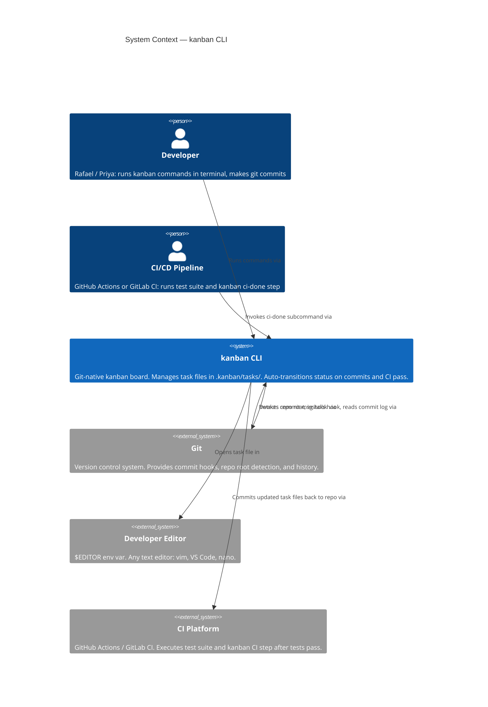
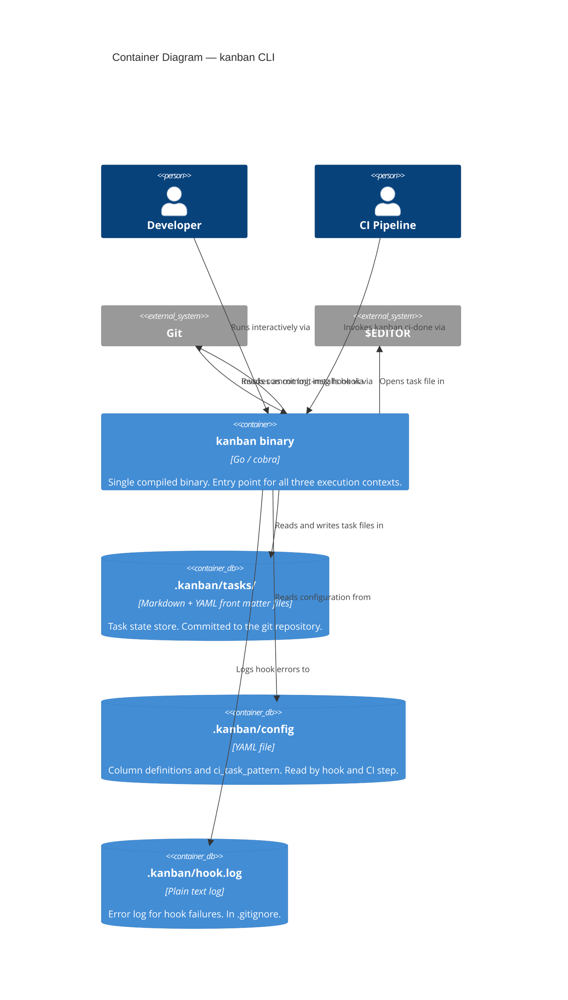
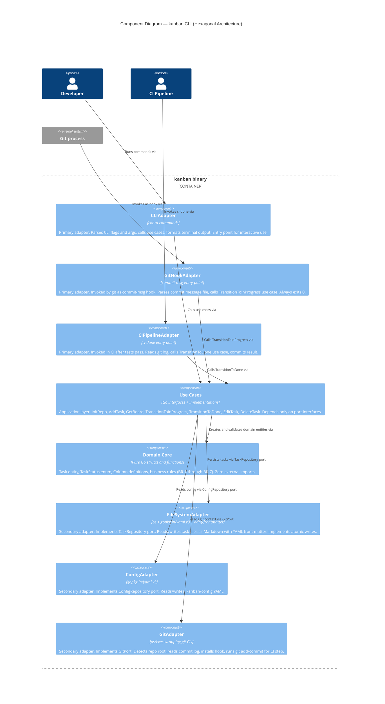

# Architecture Design: kanban-tasks

**Feature**: Git-Native Kanban Task Management CLI
**Wave**: DESIGN
**Date**: 2026-03-15
**Architect**: Morgan (solution-architect)

---

## 1. System Context

The kanban CLI is a developer tool that lives entirely inside a git repository. There is no external database, no API server, and no synchronisation service. The system's external actors are the developer (interactive), the git process (hook invocation), and the CI platform (pipeline step invocation).

### C4 Level 1 — System Context



---

## 2. Container Diagram

The kanban system is a single deployable unit: one Go binary. However, it has three distinct entry points that activate different primary adapters against the shared domain core.

### C4 Level 2 — Containers



---

## 3. Component Diagram — Hexagonal Core

The kanban binary is structured as a hexagonal (ports-and-adapters) application. This diagram shows the internal component boundaries.

### C4 Level 3 — Components (Hexagonal Core)



---

## 4. Hexagonal Architecture Description

### Dependency Rule

All dependencies point inward. The domain core has zero imports from any adapter or external library. Use cases import only domain types and port interfaces. Adapters import use cases (for wiring) and implement port interfaces.

```
CLIAdapter ──────────────┐
GitHookAdapter ──────────┼──► UseCases ──► Domain Core
CIPipelineAdapter ───────┘        │
                                  │ (via port interfaces)
                          ┌───────┴───────┐
                          ▼               ▼
                   FileSystemAdapter  GitAdapter
                   ConfigAdapter
```

### Primary Ports (Driving — Inbound)

These are the interfaces the use cases expose to primary adapters.

| Port | Operations |
|------|-----------|
| `InitRepoUseCase` | `Init(repoRoot string) error` |
| `AddTaskUseCase` | `Add(input AddTaskInput) (Task, error)` |
| `GetBoardUseCase` | `GetBoard(repoRoot string) (Board, error)` |
| `TransitionUseCase` | `ToInProgress(repoRoot, taskID string) (Transition, error)` |
| `TransitionUseCase` | `ToDone(repoRoot string, taskIDs []string) ([]Transition, error)` |
| `EditTaskUseCase` | `Edit(repoRoot, taskID string) (TaskDiff, error)` |
| `DeleteTaskUseCase` | `Delete(repoRoot, taskID string, force bool) error` |

### Secondary Ports (Driven — Outbound)

These are the interfaces the use cases depend on; adapters implement them.

| Port | Responsibility |
|------|---------------|
| `TaskRepository` | Read task by ID, write task, list all tasks, delete task, generate next ID |
| `ConfigRepository` | Read .kanban/config, write .kanban/config |
| `GitPort` | Detect repo root, read commit messages in range, run git commit, install hook |

### Domain Core

Contains only pure Go types and functions with no external imports beyond the standard library.

| Type | Role |
|------|------|
| `Task` | Aggregate root. Fields: ID, Title, Status, Priority, Due, Assignee, Description |
| `TaskStatus` | Enum: `todo`, `in-progress`, `done` |
| `Column` | Value object: name, display label |
| `Board` | Collection of tasks grouped by status |
| `Transition` | Value object: TaskID, FromStatus, ToStatus |
| Business rules | `ValidateNewTask`, `CanTransitionTo`, `IsOverdue`, `NextID` |

---

## 5. Architecture Enforcement

Style: Hexagonal (Ports and Adapters)
Language: Go
Tool: `go-arch-lint` (MIT, `github.com/fe3dback/go-arch-lint`)

Rules to enforce (configured in `.go-arch-lint.yml`):
- Domain package (`internal/domain`) has zero imports from `internal/adapters` or `internal/infrastructure`
- Use case package (`internal/usecases`) has zero imports from `internal/adapters`
- No adapter-to-adapter dependencies (e.g., `adapters/cli` must not import `adapters/filesystem`)
- All dependencies on secondary ports cross via interfaces defined in `internal/ports`

`go-arch-lint` runs in CI as a pre-build fast check, before unit tests. A failing arch-lint check fails the CI pipeline with an actionable error message identifying the violating import.

---

## 6. Quality Attribute Strategies

### Performance (NFR-1)

- Board command reads task files sequentially from `.kanban/tasks/`. At 500 files, sequential I/O completes in ~10-20ms on a modern SSD; well within the 100ms budget.
- Hook command reads a single commit message file and one matching task file. Target: <10ms Go execution + git invocation overhead.
- No caching layer in MVP (requirements explicitly state "no cache for MVP"); the performance budget is met without it.

### Reliability (NFR-2)

- All task file writes use atomic write pattern: write to `.kanban/tasks/TASK-NNN.md.tmp`, then `os.Rename`. `Rename` is atomic on POSIX filesystems.
- Hook wraps all execution in a top-level recover; logs to `.kanban/hook.log`; always exits 0.
- ID generation uses filesystem-level atomicity: `os.OpenFile` with `O_CREATE|O_EXCL` to detect collision before writing.

### Testability

- Domain core: unit-tested with zero mocks (pure functions and value objects)
- Use cases: unit-tested with in-memory mock implementations of `TaskRepository`, `ConfigRepository`, and `GitPort`
- Adapters: integration-tested against real filesystem and real git repository in a temp directory
- Hook entry point: tested with fabricated commit message files

### Security

- The hook and CI step do not execute user-supplied strings as shell commands. Task IDs extracted by regex are used as file path components after validation (alphanumeric + hyphen only).
- The CI step commits only to `.kanban/tasks/`. No other paths are written.
- `.kanban/hook.log` is added to `.gitignore` by `kanban init` so internal error details are not committed.
