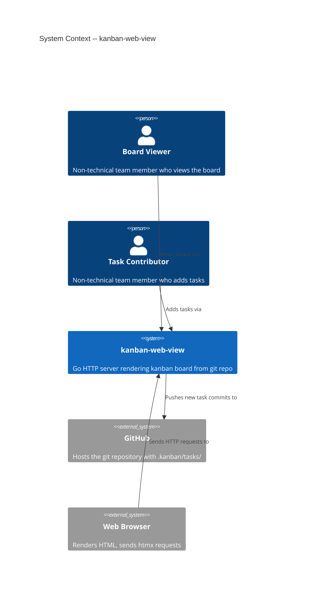
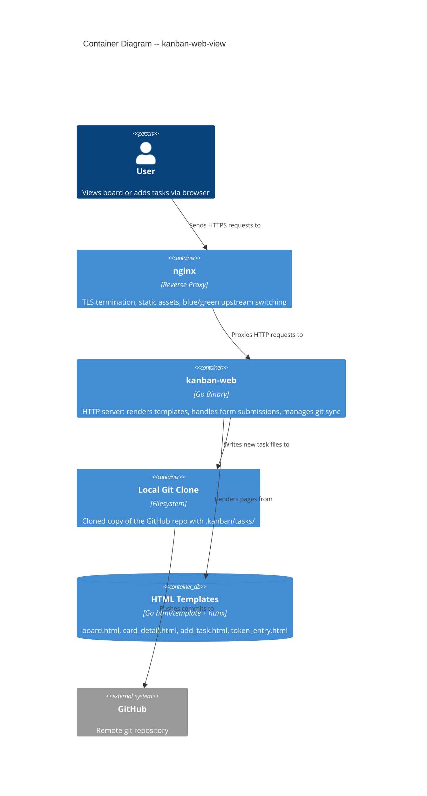

# Architecture: kanban-web-view

**Date**: 2026-03-29
**Status**: Final
**Wave**: DESIGN

---

## 1. System Context

kanban-web-view is a separate Go binary (`kanban-web`) that serves a browser-based view of the git-native kanban board. It clones a GitHub repository locally, reads task files using the existing domain and use case layers, and renders HTML pages using Go templates with htmx for interactivity. Authenticated users can add tasks, which the server commits and pushes back to the remote repository.

### Capabilities

| Capability | Story | Auth Required |
|-----------|-------|---------------|
| View board (columns + cards) | US-WV-02 | No (public repos) |
| View card details | US-WV-03 | No (public repos) |
| Enter GitHub token + display name | US-WV-04 | N/A (enables auth) |
| Add task via web form | US-WV-05 | Yes (GitHub PAT) |

### C4 System Context (L1)



### C4 Container (L2)



---

## 2. Component Architecture

### Package Layout (Updated)

The existing CLI binary moves from `cmd/kanban/` to `cmd/kanban-cli/`. The web binary gets its own entry point at `cmd/kanban-web/`.

```
cmd/
  kanban-cli/          # CLI binary entry point (renamed from cmd/kanban/)
    main.go            # Wires CLI adapter + ports + use cases
  kanban-web/          # Web binary entry point (NEW)
    main.go            # Wires web adapter + ports + use cases + git remote ops

internal/
  domain/              # Pure types -- UNCHANGED
  ports/               # Port interfaces -- EXTENDED with RemoteGitPort
  usecases/            # Application logic -- EXTENDED with AddTaskAndPush
  adapters/
    cli/               # cobra commands (primary adapter) -- UNCHANGED
    web/               # HTTP handlers (primary adapter) -- NEW
      handler.go       # HTTP route handlers
      middleware.go    # Auth middleware, CSRF, security headers
      server.go        # HTTP server setup and configuration
    filesystem/        # Task and config file I/O -- UNCHANGED
    git/               # git process wrapper -- EXTENDED with remote ops
```

### Template Files

Templates are named by page, stored alongside the web adapter:

```
internal/adapters/web/
  templates/
    board.html           # Board view with three columns
    card_detail.html     # Single task detail view
    add_task.html        # New task form
    token_entry.html     # GitHub token + display name entry form
    layout.html          # Shared HTML layout (head, nav, footer)
```

### Component Boundaries

| Component | Responsibility | Depends On |
|-----------|---------------|------------|
| `cmd/kanban-web/main.go` | Wiring: construct adapters, inject into use cases, start server | All adapters, all use cases |
| `internal/adapters/web/` | HTTP request handling, template rendering, cookie management, CSRF | `internal/usecases`, `internal/ports` |
| `internal/usecases/` (existing) | `GetBoard`, `AddTask` -- reused without modification | `internal/domain`, `internal/ports` |
| `internal/usecases/` (new) | `AddTaskAndPush` -- orchestrates add + git commit + push | `internal/domain`, `internal/ports` |
| `internal/ports/` (extended) | `RemoteGitPort` interface for Add/Commit/Push/Pull | `internal/domain` |
| `internal/adapters/git/` (extended) | Implements `RemoteGitPort` using git CLI | `internal/ports` |
| `internal/adapters/filesystem/` | Reads/writes task files -- reused without modification | `internal/ports` |

### Dependency Rule Compliance

```
web adapter (primary) --> usecases --> ports <-- git adapter (secondary)
                                      ports <-- filesystem adapter (secondary)
```

All dependencies point inward. The web adapter is a primary adapter (driving). The git adapter and filesystem adapter are secondary adapters (driven). No adapter imports another adapter.

---

## 3. Data Flow

### Read Path: View Board (US-WV-02)

```
Browser GET /board
  --> nginx (TLS termination, proxy)
    --> web handler
      --> GetBoard.Execute(repoRoot, "")
        --> ConfigRepository.Read(repoRoot)
        --> TaskRepository.ListAll(repoRoot)
        --> returns domain.Board
      --> render board.html with Board data
    --> HTTP 200 + HTML response
  --> Browser renders board
```

The local git clone is the `repoRoot`. A background goroutine calls `RemoteGitPort.Pull()` on a configurable interval to keep the local clone fresh.

### Read Path: View Card Detail (US-WV-03)

```
Browser GET /task/{id}  (htmx partial request)
  --> nginx
    --> web handler
      --> TaskRepository.FindByID(repoRoot, id)
        --> returns domain.Task
      --> render card_detail.html with Task data
    --> HTTP 200 + HTML fragment (htmx swaps into page)
```

htmx enables the card detail to load as a partial HTML fragment swapped into the existing page without a full page reload.

### Write Path: Add Task (US-WV-05)

```
Browser POST /task  (htmx form submission)
  --> nginx
    --> web handler (auth middleware checks cookie)
      --> validate CSRF token
      --> AddTaskAndPush.Execute(repoRoot, input, token)
        --> AddTask.Execute(repoRoot, input)
          --> TaskRepository.Save(repoRoot, task)
        --> RemoteGitPort.Add(repoRoot, taskFilePath)
        --> RemoteGitPort.Commit(repoRoot, message)
        --> RemoteGitPort.Push(repoRoot, token)
      --> render board.html (updated) or success fragment
    --> HTTP 200 + updated board HTML
```

The `Push` operation uses the user's GitHub PAT (from the cookie) to authenticate with the remote. The token is passed per-operation, never stored on disk.

### Auth Flow: Token Entry (US-WV-04)

```
Browser clicks "Add Task" (no cookie present)
  --> web handler detects no auth cookie
  --> returns token_entry.html form

Browser POST /auth/token  (display name + GitHub PAT)
  --> web handler
    --> validates token against GitHub API (GET /user)
    --> on success: sets HttpOnly cookie with encrypted token + display name
    --> redirects to board
```

---

## 4. Port Extension: RemoteGitPort

A new port interface is added to `internal/ports/git.go`:

```
RemoteGitPort interface {
    Clone(url, destPath string) error
    Pull(repoRoot string) error
    Add(repoRoot string, paths ...string) error
    Commit(repoRoot, message string) error
    Push(repoRoot, token string) error
}
```

This interface is implemented by extending `internal/adapters/git/git_adapter.go` (or a new struct in the same package). The `Push` method accepts the token as a parameter to inject it into the git remote URL for HTTPS authentication, avoiding any on-disk credential storage.

**Rationale**: The user confirmed git push operations belong in the existing `internal/adapters/git/` package. Remote git operations are a natural extension of the existing `GitPort` responsibilities.

**Design choice**: `RemoteGitPort` is a separate interface from `GitPort` (interface segregation). The CLI binary does not need remote operations. Only `kanban-web` wires `RemoteGitPort`.

---

## 5. Technology Stack

| Component | Technology | License | Rationale |
|-----------|-----------|---------|-----------|
| Language | Go 1.22+ | BSD-3-Clause | Existing codebase |
| HTTP server | `net/http` (stdlib) | BSD-3-Clause | No external dependency needed for simple routing |
| Templating | `html/template` (stdlib) | BSD-3-Clause | Existing Go ecosystem, auto-escapes HTML |
| Client interactivity | htmx 2.x | BSD-2-Clause | Partial page updates without writing JavaScript; declared in HTML attributes |
| Reverse proxy | nginx | BSD-2-Clause | TLS termination, static asset serving, blue/green deployment support |
| Deployment | GCP Compute Engine e2-micro | Free tier | Zero budget constraint |
| Architecture enforcement | go-arch-lint | MIT | Existing CI enforcement |

### htmx Integration

htmx is a single JavaScript file (~14KB gzipped) included via a `<script>` tag. It enables:

- `hx-get="/task/{id}"` on card elements to load detail views as HTML fragments
- `hx-post="/task"` on the add-task form to submit without full page reload
- `hx-swap="innerHTML"` to replace page sections with server-rendered HTML
- `hx-trigger="click"` for interaction bindings

No custom JavaScript is required. All interactivity is declared via HTML attributes. The server returns HTML fragments, not JSON.

---

## 6. Deployment Architecture

### nginx + Blue/Green Deployments

```
                     Internet
                        |
                   [nginx :443]
                   TLS termination
                   /            \
            [upstream blue]   [upstream green]
            kanban-web :8080  kanban-web :8081
                   \            /
              [shared local git clone]
                        |
                   [GitHub remote]
```

**Blue/Green switching**: nginx upstream configuration is toggled to route traffic between the blue and green instances. During deployment:

1. Deploy new version to the inactive instance (e.g., green)
2. Health check the new instance
3. Update nginx upstream to point to green
4. Reload nginx (`nginx -s reload` -- zero downtime)
5. Stop the old blue instance

**nginx upstream config pattern**:

```
upstream kanban_backend {
    server 127.0.0.1:8080;  # blue (active)
    # server 127.0.0.1:8081;  # green (standby)
}
```

Switching is done by uncommenting/commenting the active line and reloading nginx. A deployment script automates this.

### Single-Server Layout (e2-micro)

Both blue and green instances, nginx, and the local git clone all run on the same e2-micro VM. This respects the zero-budget constraint. The local git clone is shared between instances (read path is safe; write path is serialized by a mutex in the use case).

---

## 7. Configuration

All configuration is via CLI flags with environment variable fallbacks. Sensible defaults for all values.

| Parameter | Flag | Env Var | Default | Description |
|-----------|------|---------|---------|-------------|
| Listen address | `--addr` | `KANBAN_WEB_ADDR` | `:8080` | HTTP listen address |
| Repository URL | `--repo` | `KANBAN_WEB_REPO` | (required) | GitHub repository URL to clone |
| Clone path | `--clone-path` | `KANBAN_WEB_CLONE_PATH` | `/var/kanban/repo` | Local path for git clone |
| Sync interval | `--sync-interval` | `KANBAN_WEB_SYNC_INTERVAL` | `60s` | How often to `git pull` from remote |
| Cookie encryption key | `--cookie-key` | `KANBAN_WEB_COOKIE_KEY` | (required for write mode) | 32-byte hex key for encrypting auth cookies |

**Sync interval rationale**: The user requested this be configurable to allow experimentation. Default of 60 seconds balances freshness with GitHub API rate limits and e2-micro CPU constraints.

---

## 8. Security Design

### Token Handling

- **Client-side cookie**: The GitHub PAT and display name are stored in an encrypted `HttpOnly`, `Secure`, `SameSite=Strict` cookie
- **Encryption**: AES-256-GCM using the `--cookie-key` parameter. The server encrypts on write and decrypts on read
- **No server-side storage**: The token is never written to disk or held in memory beyond the request lifecycle
- **Per-push injection**: The token is injected into the git remote URL only for the duration of the push operation (`https://{token}@github.com/...`)
- **Token validation**: On first entry, the server validates the token by calling `GET https://api.github.com/user` with the token as Bearer auth. Invalid tokens are rejected immediately

### CSRF Protection

- All state-changing forms include a CSRF token (double-submit cookie pattern)
- The CSRF token is generated per session and validated on every POST
- htmx automatically includes the CSRF token via `hx-headers` configured on the `<body>` element

### HTTP Security Headers

All responses include:

| Header | Value |
|--------|-------|
| `Content-Security-Policy` | `default-src 'self'; script-src 'self' unpkg.com` (htmx CDN) |
| `Strict-Transport-Security` | `max-age=63072000; includeSubDomains` |
| `X-Content-Type-Options` | `nosniff` |
| `X-Frame-Options` | `DENY` |
| `Referrer-Policy` | `strict-origin-when-cross-origin` |

### Input Validation

- Task title: required, max 200 characters
- Description: optional, max 5000 characters
- Priority: validated against allowed values (low, medium, high)
- Assignee: optional, validated as email format
- All user input is passed through `html/template` auto-escaping before rendering

### Write Concurrency

A mutex serializes all write operations (add task + commit + push) to prevent concurrent modifications to the local git clone. This is acceptable for the expected low write volume on an e2-micro instance.

---

## 9. Quality Attribute Strategies

| Attribute | Strategy |
|-----------|---------|
| **Maintainability** | Hexagonal architecture with dependency inversion; web adapter is just another primary adapter. Existing use cases reused without modification. |
| **Testability** | Web handlers testable with `httptest`. Use cases already tested with mock ports. Git remote operations testable with `t.TempDir()` + `git init --bare`. |
| **Security** | Encrypted HttpOnly cookies, CSRF protection, security headers, input validation, token never on disk. |
| **Reliability** | Background sync with error recovery (log and retry on next interval). Write operations serialized via mutex. |
| **Performance** | Server-rendered HTML is fast on e2-micro. htmx reduces payload size (HTML fragments, not full pages). Local git clone avoids per-request network calls. |
| **Operability** | Configurable via env vars for easy deployment. Blue/green deployments for zero-downtime updates. |
| **Cost** | Zero budget: GCP free tier e2-micro, all OSS stack, no external services beyond GitHub. |

---

## 10. Architectural Enforcement

Existing `go-arch-lint` rules are extended to cover the new packages:

- `internal/adapters/web/` must not import `internal/adapters/cli/`, `internal/adapters/filesystem/`, or `internal/adapters/git/`
- `internal/adapters/web/` may only import `internal/usecases/`, `internal/ports/`, and `internal/domain/`
- `internal/usecases/` must not import `internal/adapters/web/`
- `cmd/kanban-web/` is the only package that wires all adapters together

---

## 11. External Integration Annotations

**Contract tests recommended for GitHub API** -- consumer-driven contracts (e.g., Pact with pact-go) to detect breaking changes before production.

| External Service | API Type | What We Consume |
|-----------------|----------|----------------|
| GitHub API | REST | `GET /user` for token validation |
| GitHub Git (HTTPS) | Git protocol over HTTPS | Clone, Pull, Push operations |

The GitHub Git protocol is stable and unlikely to break. The `GET /user` REST endpoint is the higher-risk contract boundary and should be covered by a consumer-driven contract test.

---

## 12. Story-to-Component Traceability

| Story | Components Involved |
|-------|-------------------|
| US-WV-01 | `cmd/kanban-web/`, `internal/adapters/web/` (hello world handler), nginx config, GCP VM setup |
| US-WV-02 | `internal/adapters/web/` (board handler), `board.html`, `GetBoard` use case, `RemoteGitPort.Clone/Pull`, background sync goroutine |
| US-WV-03 | `internal/adapters/web/` (task detail handler), `card_detail.html`, `TaskRepository.FindByID` |
| US-WV-04 | `internal/adapters/web/` (auth handler + middleware), `token_entry.html`, cookie encryption, GitHub API validation |
| US-WV-05 | `internal/adapters/web/` (add task handler), `add_task.html`, `AddTaskAndPush` use case, `RemoteGitPort.Add/Commit/Push` |
